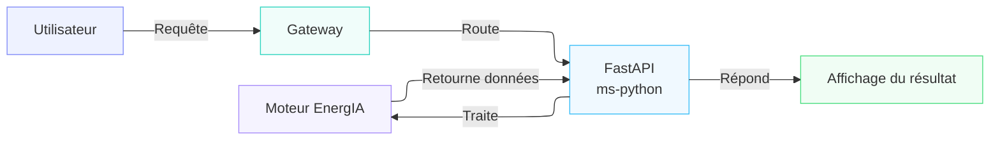
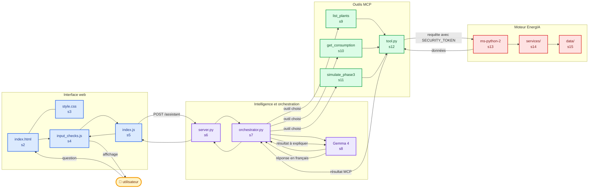
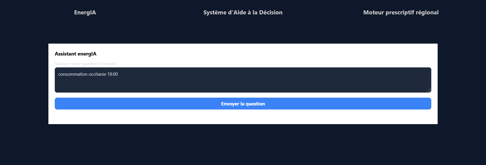

# Guide du projet energIA

Le parcours utilisateur du projet EnergIA déployé initialement est très simple :



A l'issue des 3 phases de déploiement des différentes fonctionnalités et services composant notre application, le parcours utilisateur a notablement été modifié :



L'utilisateur a le choix d'utiliser le moteur prescriptif régional mais peut également faire sa demande au système d'aide à la décision qui s'appuie sur un modèle Gemma4:e4b hébergé dans conteneur Ollama.



[!WARNING]
Tout le fonctionnement de l'application est régie par des règles simples mais importantes :

* Les calculs _**métier**_ sont isolés au sein du micro-service `ms-python-2` (Le serveur MCP ne refait pas les calculs).
* `tool.py` récupère les données en appelant FastAPI (ms-python-2).
* `gemma 4` ne doit pas inventer les données energIA.
* La réponse doit être construite à partir du JSON retourné par FastAPI.

## Conteneurisation

* **gateway** : Utilise Node.js et Express, écoute sur le port 3000.
Point d'entrée pour l'utilisateur, la passerelle fournit l'interface web et transmet les requêtes au réseau de micro-services (_ms-python-2_, _mcp-server_, _llm_).

> ```bash docker pull tomtoomuch/energia-gateway ```

* **ms-python** : Utilise FastAPI, écoute sur le port 8000.
Ce conteneur contient le moteur prescriptif régional issu de la phase de déploiement initial.

> ```bash docker pull tomtoomuch/energia-ms-python```

* **ms-python-2** : Utilise FastAPI, écoute sur le port 8002. Ce conteneur contient le moteur temporel actuel, qui permet de lancer des simulations (Phases 1, 2 et 3) et fournit les outils et données au serveur MCP.

> ```bash docker pull tomtoomuch/energia-ms-python-2```

* **llm** : Utilise l'image officielle d'Ollama fournie par Docker, écoute sur le port 11434. Le modèle est récupéré puis chargé automatiquement au montage du conteneur. Nous utilisons le modèle [`gemma4:e4b`](https://ollama.com/library/gemma4 "Lien vers la page du modèle de langage gemma4:e4b disponible dans la bibliothèque de modèle d'Ollama). Un fichier docker-commpose.gpu_or_cpu.yml permet d'activer la prise en charge des GPU pour le LLM au montage de l'application.

> ```bash docker pull tomtoomuch/energia-llm```

* **mcp-server** : Utilise FastMCP, écoute sur le port 8003. Expose les ressources, les outils MCP et la route HTTP (```/assistant```) vers le système d'aide à la décision.

> ```bash docker pull tomtoomuch/energia-mcp-server```

## Arborescence du projet

* `docker-compose.yml` : Configure les ports, les dépendances et les fichiers `.env`.
* `.env` : Contient les variables de configuration (ports, adresses internes, `SECURITY_TOKEN`, modèle ollama).
* [`README.md`](./README.md "Fichier README.md du déploiement initial du moteur prescriptif régional") : Présente le moteur principal et les commandes historiques.
* [`README-PHASES.md`](./README-PHASES.md "Fichier README-PHASES.md décrivant les 3 phases de déploiement successives") : Décrit le système de simulation de consommation dans le temps par le moteur prescriptif national.
* `Comment-Demarer-proj.txt` : Contient les commandes de démarrage et de vérification.
* `introduction.txt` : Explique l’évolution du moteur et les différentes parties du projet.

## Structure des dossiers

**gateway/**

* `Dockerfile` : Construit le conteneur Node.js.
* `package.json` : Contient les dépendances Node.js (`express`, `axios`).
* `index.js` : Crée la gateway Express avec endpoints pour la santé (`/health*`), récupération de données (`/plants`, `/regions`, `/network`), simulation (`/simulate`), et l'assistant (`POST /assistant`).

**mcp_server/**

* `Dockerfile` : Construit l'image du serveur MCP.
* `requirements.txt` : Contient les dépendances Python (`mcp`, `httpx`, `ollama`, `python-dotenv`).
* `tool.py` : Le client HTTP de FastAPI, gère la construction des requêtes vers FastAPI en y ajoutant `SECURITY_TOKEN`.
* `services/apply_consumption_events.py` : Détermine et applique la variation d’un événement.
* `services/scenario_json.py` : Valide, exporte ou importe un scénario.
* `services/charts.py` : Génère les graphiques de la phase 2.
* `services/long_simulation.py` : Répète les données journalières pour simuler sur une semaine, un mois ou une année.
* `services/energia_service.py` : Contient une façade métier expérimentale (appelée par MCP).
* `services/dispatch.py` : Contient une fonction historique simple de répartition.

## Fichiers de données

* `energia-journee-reference-consommation.json` : Contient les 96 horaires de la journée (consommation nationale et régionale).
* `energia-parametres-temporels-nucleaire.json` : Contient la production initiale, les puissances min/max, et les rampes.
* `energia-production-non-pilotable.json` : Contient la production solaire et éolienne.
* `energia-scenarios-phase3-exemples.json` : Contient les scénarios (ex: `evening_peak_occitanie`).
* `parc_nucleaire_prescriptif_france.json` : Contient les centrales, régions, liaisons et paramètres de simulation.

## Test

* `ms-python/tests` : Contient les tests du premier moteur.
* `ms-python-2/tests/test_engine.py` : Teste le moteur et les allocations.
* `ms-python-2/tests/test_temporal_phases.py` : Teste les phases 1, 2 et 3.

---
## Variables d’environnement
---
**Dans Docker :**
* `PYTHON_SERVICE_URL_2`: `http://ms-python-2:8002`
* `PYTHON_MCP_URL`: `http://mcp-server:8003`
* `MCP_URL`: `http://mcp-server:8003/mcp`
* `OLLAMA_HOST`: `http://llm:11434`
* `OLLAMA_MODEL`: `gemma4:e4b`

**Depuis Windows :**
* `http://127.0.0.1:8002`
* `http://127.0.0.1:8003`
* `http://127.0.0.1:11434`

*Note : Les noms de services (`ms-python-2`, `mcp-server`, `llm`) ne fonctionnent que dans le réseau Docker.*

---
## Limitations actuelles
---
*   La question doit respecter le format : `consommation région heure` (Ex: consommation occitanie 18:00).
*   La consommation retournée est une référence, pas une mesure en temps réel.
*   Gemma 4 ne choisit pas encore automatiquement l'outil MCP.
*   Une simulation phase 3 complète peut produire un très grand JSON.
*   Les réponses de Gemma 4 peuvent varier.
*   `mcp_server` ne possède pas encore de tests automatisés.


## Commandes pour tester le projet

1.  **Préparation :**

    ```powershell
    cd C:\python-projs\energIA-prescription-nationale
    ```
2.  **Vérification Docker :**
    ```powershell
    docker version
    ```
3.  **Construction et Démarrage :**
    ```powershell
    docker compose build
    docker compose up -d
    ```

4.  **Vérification des services :**
    ```powershell
    docker compose ps
    # Doivent être Up : gateway, ms-python, ms-python-2, llm, mcp-server
    ```

5.  **Tests API :**
    ```powershell
    # Vérifier FastAPI
    Invoke-RestMethod http://127.0.0.1:8002/health

    # Vérifier MCP
    Invoke-RestMethod http://127.0.0.1:8003/health

    # Vérifier la gateway
    Invoke-RestMethod http://127.0.0.1:3000/health

    # Vérifier ollama
    Invoke-RestMethod http://127.0.0.1:11434/api/tags

    # Lister les modèles installés
    docker compose exec llm ollama list
    # Modèle attendu : gemma4:e4b
    ```

6.  **Test des interactions :**

    ```powershell
    # Tester MCP vers FastAPI
    docker compose exec mcp-server python -c "import tool; print(tool.get_plants()['plants_count'])"
    # Résultat attendu : 18

    # Tester l’assistant dans le terminal
    docker compose exec -it mcp-server python orchestrator.py
    poser
    consommation occitanie 18:00

    # Tester l’interface web
    # Ouvrir dans le navigateur : http://127.0.0.1:3000
    # Écrire : consommation occitanie 18:00
    # Cliquer sur : envoyer la question
    ```
7.  **Logs et Maintenance :**
    ```powershell
    # Consulter les logs (dernier filtre)
    docker compose logs --tail=100 gateway
    # logs de FastAPI
    docker compose logs --tail=100 ms-python-2
    # logs du serveur MCP
    docker compose logs --tail=100 mcp-server
    # logs de ollama
    docker compose logs --tail=100 llm

    # Suivre tous les logs en direct
    docker compose logs -f

    # Reconstruire après une modification (Ex: mcp_server)
    docker compose build mcp-server
    docker compose up -d --force-recreate mcp-server

    # Arrêter le projet
    docker compose down

    # Vérifier git avant le transfert
    git status
    git log --oneline -15
    ```