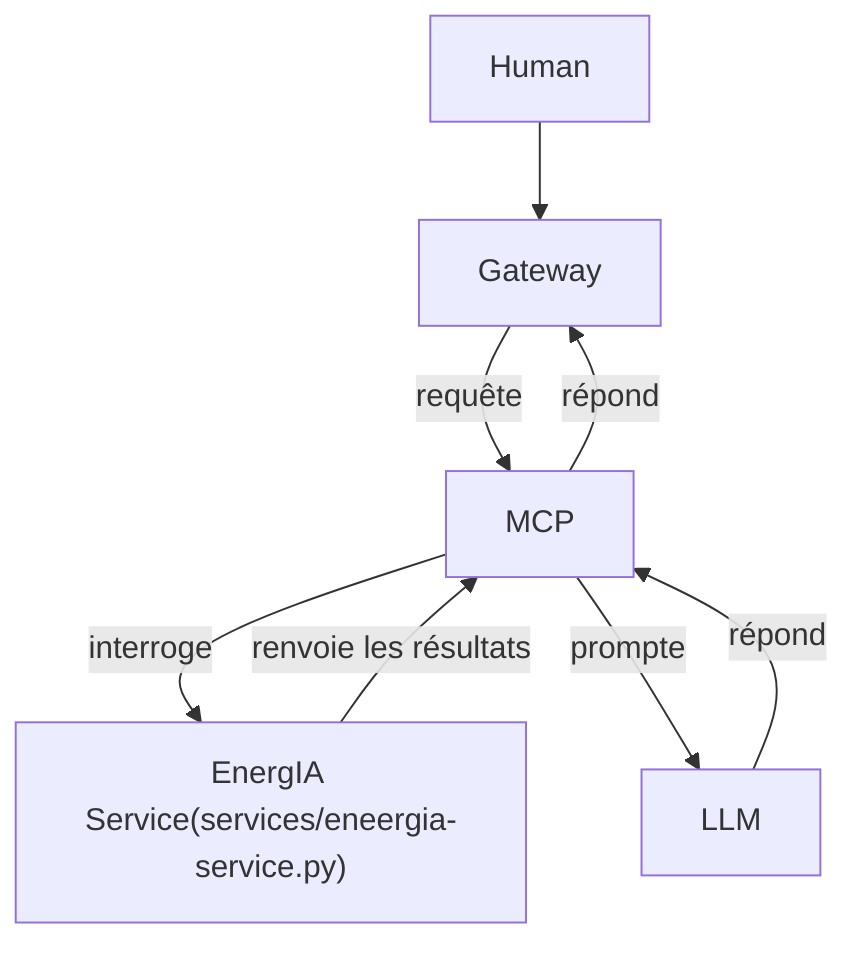

# README LLM

## Ajout du LLM au coeur de notre application

Cette phase de déploiement consiste à ajouter dans notre flux de traitement des données et de production de prescriptions, un grand modèle de langage.

Nous choisissons `gemma4:e4b` car il offre un équilibre entre raisonnement, appels d'outils et linguistique. De plus, il foncitonne, un peu plus lentement, mais tout aussi bien en sollicitant les CPUs que les GPUs.

Nous procédons donc à l'ajout d'un serveur MCP pour gérer les prompts et appels d'outils pour la récupération des données indispensables à la production de réponse par le LLM.



## Changement lancement projet

Afin de solutionner le fait que tous les membres de l'équipe ne disposent pas de GPU pour faire fonctionner le modèle d'IA, nous avons un docker-compose.gpu_or_cpu.yml spécifique pour compiler et monter les conteneurs de notre application en prenant en charge ou non l'utilisation du CPU.

1. Créer un fichier dans le répertoire racine de notre application, côte à côte avec le docker-compose.yml.

    J'ai choisi comme nom pour ce fichier : ```docker-compose.gpu_or_cpu.yml```, il est ensuite nécessaire d'y ajouter le contenu suivant :

    ```yml
    services:
      llm:
    #    deploy:
    #     resources:
    #        limits:
    #          cpus: '2'
    #
    #        reservations:
    #          cpus: '1'
        deploy:
          resources:
            reservations:
              devices:
                - driver: nvidia
                  count: all
                  capabilities: [gpu]
    ```

2. Tu l'enregistres

3. Puis dans un terminal ouvert dans le dossier racine du projet :

```bash
docker compose -f docker-compose.yml -f docker-compose.gpu_or_cpu.yml up -d --build
```

