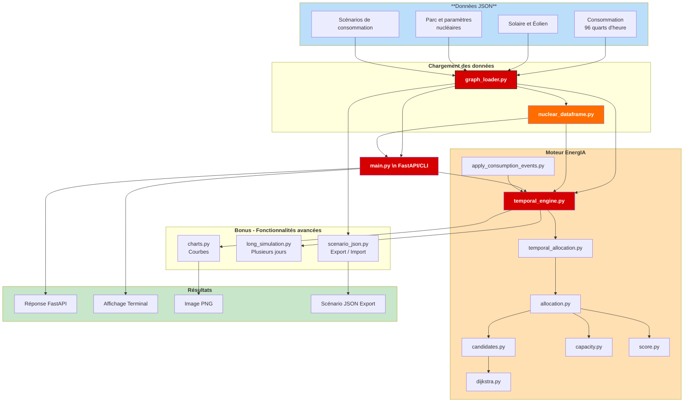

# Détails techniques des phases de déploiement



## Phase 1

### Etape 1 : charger les données depuis le fichier JSON

**services/graph_loader.py**
Le premier parent remonte vers services et le second vers ms-python-2.
**data** correspond au dossier contenant les fichiers JSON.
Les chemins construits permettent de retrouver les fichiers de données depuis le fichier Python.

```py
def load_json(path)
```

Cette fonction ouvre un fichier JSON en utilisant le chemin précédemment construit.
Elle transforme ensuite son contenu en dictionnaire Python :

```py
return json.load(file)
```

### Etape 2 : charger les données historiques du parc nucléaire métropolitain

```py
def load_data(path=FLEET_PATH)
```

Cette fonction charge le jeu de données du parc de centrales nucléaires puis vérifie que le fichier contient bien :

* les centrales
* les régions
* les liaisons entre les centrales

### Etape 3 : construction de l'index des centrales

```py
def build_plants_index(data)
```

Cette fonction transforme la liste des centrales en dictionnaire. Chaque centrale devient accessible directement avec son identifiant.

```json
{
    "belleville": {
        "id": "belleville",
        "name": "Belleville-sur-Loire"
    }
}
```

### Etape 4 : construction de l'index des régions

```py
def build_regions_index(data)
```

Cette fonction transforme la liste des régions en dictionnaire. Chaque région devient accessible directement avec son identifiant
_exemple_

```json
{
    "occitanie": {
        "id": "occitanie",
        "name": "Occitanie"
    }
}
```

### Etape 5 : construction du graphe des centrales

```py
def build_graph(data)
```

Cette fonction construit le graphe des liaisons entre les centrales. Chaque centrale possède une liste de centrales voisines.
Chaque liaison conserve :

* l’identifiant de la liaison
* la centrale de départ
* la centrale d’arrivée
* la distance
* le pourcentage de perte
* la capacité maximale de transfert
* la disponibilité

Si une liaison est **bidirectionnelle** la fonction ajoute également le chemin inverse.

### Etape 6 : chargement des données de consommation pour une journée entière

Nous travaillons ici avec les valeurs de consommation pour une journée d'équinoxe afin d'éviter les trop grosses irrégularités de consommation.

```py
def load_reference_consumption(
    path=REFERENCE_CONSUMPTION_PATH
)
```

Cette fonction charge les données les consommations nationales et régionales depuis le fichier de consommation.

```py
data = load_json(path)
```

La fonction récupère ensuite les variables :

* timestamps
* national_total_consumption_mw
* regions

Elle vérifie que la liste des horaires et la consommation nationale contiennent bien les 96 valeurs attendues : 
**24 heures × 4 quarts d’heure = 96**

La fonciton vérifie également que chaque région possède 96 valeurs de consommation. Si les données sont incorrectes, elle renvoie une erreur claire

### Etape 7 : chargement des paramètres temporels des centrales

```py
def load_temporal_nuclear_parameters(
    path=TEMPORAL_NUCLEAR_PARAMETERS_PATH
)
```

Cette fonction charge les paramètres temporels des centrales nucléaires.
Elle vérifie la présence des champs attendus (et nécessaires) :

* plant_id
* initial_output_mw_at_23_45_previous_day
* minimum_operating_power_mw
* maximum_power_mw
* max_ramp_up_mw_per_15_min
* max_ramp_down_mw_per_15_min

La fonciton vérifie ensuite :

* qu'il n'y a pas de doublons dans les identifiants de centrales
* que la puissaance minimale est toujours inférieure à la puissance maximale
* que la production initale est bien comprise entre le plancher et le plafond
* que les rampes de montée et descente en puissance ne sont pas négatives

### Etape 8 : construction d'un DataFrame avec les données concernant les centrales et leurs paramètres temporels

Le script _**services/nuclear_dataframe.py**_ aggrège les jeu de données concernant les centrales et leurs paramètres temporels.

La fonction principale _**build_nuclear_dataframe()**_ charge les 2 fichiers JSON :

* parc_nucleaire_prescriptif_france.json
* energia-parametres-temporels-nucleaire.json

Elle transforme la liste des centrales en DataFrame :

```py
fleet_dataframe = pd.json_normalize(
    fleet_plants,
    sep="_"
)
```

Elle transforme ensuite la liste des paramètres temporels des centrales en DataFrame :

```py
temporal_dataframe = pd.DataFrame(
    temporal_plants
)
```

Elle fusionne ensuite les 2 dataframes en utilisant comme jonction la colonne "plant_id" :

```py
dataframe = fleet_dataframe.merge(
    temporal_dataframe,
    on="plant_id"
)
```

Le DataFrame final contient notamment :

* plant_id
* plant_name
* location_region_id
* plant_edges
* initial_output_mw_at_23_45_previous_day
* minimum_operating_power_mw
* maximum_power_mw
* max_ramp_up_mw_per_15_min
* max_ramp_down_mw_per_15_min
* available

Chaque enregistrement représente une centtrale. La colonne "plant_edges" contient les liaisons associées à la centrale.

### Etape 9 : Intégration des contraintes du déploiement initial du moteur prescriptif régional

Cette évolution relie le moteur temporel, qui simule la production toutes les 15 minutes, au moteur d’allocation régionale développé pour le déploiement initial.

#### Modifications réalisées

1. **services/capacity.py**

    _**dispatchable_margin()**_ calcule maintenant la marge disponible depuis ```current_output_mw```, c’est-à-dire la production du quart d’heure précédent.

    _**available_capacity()**_ limite la hausse à la plus petite valeur entre la marge restante avant la puissance maximale et la rampe maximale de montée en 15 minutes.

    Lorsque l’état courant n’est pas fourni, les fonctions conservent le comportement historique afin de rester compatibles avec le moteur prescriptif régional.

2. **services/score.py**

    _**candidate_score()**_ calcule maintenant le taux de saturation final depuis la production courante. Une centrale déjà proche de sa puissance maximale reçoit ainsi une pénalité de saturation adaptée à son état réel.

3. **services/allocation.py**

    _**allocate()**_ peut maintenant recevoir :

    * _**current_state**_ : état qui évolue après chaque allocation régionale,
    * _**step_initial_state**_ : état fixe au début du quart d’heure,
    * _**plant_limits**_ : limites temporelles accessibles pendant le pas actuel.

    La distinction entre _**current_state**_ et _**step_initial_state**_ empêche une centrale de réutiliser plusieurs fois sa rampe de montée lorsque plusieurs régions sont traitées pendant le même quart d’heure.

    L’allocation respecte simultanément :

    * la marge disponible ;
    * la rampe de montée ;
    * les limites temporelles ;
    * la capacité du chemin ;
    * la demande restante ;
    * le score de la centrale.

4. **services/temporal_allocation.py**

    _**distribute_change_between_regions()**_ répartit la hausse nationale nécessaire entre les régions proportionnellement à leur consommation.
    _**distribute_down_change()**_ répartit une baisse de production entre les centrales selon leur flexibilité de descente.

    _**allocate_regional_demands()**_ :

    * compare la demande avec la production du quart d’heure précédent ;
    * détermine si le parc doit monter, descendre ou rester stable ;
    * appelle _**allocate()**_ pour chaque région en cas de hausse ;
    * conserve les rampes entre les différentes allocations régionales ;
    * met à jour l’état des centrales ;
    * enregistre les MW impossibles à attribuer dans _**missing_mw**_ ;
    * enregistre le surplus impossible à supprimer dans _**forced_surplus_mw**_.

5. **services/temporal_engine.py**

    Ce script calcule la production nucléaire toutes les 15 minutes.

    La petite valeur EPSILON évite les problèmes d'arrondi avec les nombres décimaux. Une différence plus petite qu'Epsiolon est considérée comme nulle

    _**build_initial_state()**_ 
    Cette fonction préparze la production initiale des centrales à 23h45, la veille, avant le début de la journée. Elle crée un dictionnaire contenant l'identifiant et la production de chaque centrale.

    ```json
    {
    "belleville": 1493,
    "blayais": 2075
    }
    ```

    La fonction vérifie ensuite que la puissance minimale ne dépasse pas la puissance maximale et que chaque production initale est bien comprise entre le minimum et le maximum de la centrale.

    Le script récupère ensuite la conosommation de chaque région pour un quart d'heure :

    ```py
    def get_regional_consumption(
    consumption_data,
    index
    )
    ```

    _exemple de résultat pour 00:00_

    ```json
    {
    "ile_de_france": 5335,
    "occitanie": 2450
    }
    ```

    L'index représente la position du quart d'heure dans les données :

    ```txt
    0 → 00:00
    1 → 00:15
    2 → 00:30
    ```

    _**calculate_plant_limits()**_ calcule les puissances minimales et maximales accessibles pendant les 15 prochaines minutes :

    ```py
    def calculate_plant_limits(
    plant,
    current_output_mw
    )
    ```

    Pour calculer la **limite minimale** accessible :

    ```py
    minimum_reachable_mw = max(
    minimum_mw,
    current_output_mw - ramp_down_mw
    )
    ```

    Pour calculer la **limite maximale** accessible :

    ```py
    maximum_reachable_mw = min(
    maximum_mw,
    current_output_mw + ramp_up_mw
    )
    ```

    La **flexibilité de montée** correspond à :

    ```py
    maximum_reachable_mw - current_output_mw
    ```

    La **flexibilité de descente** correspond à :

    ```py
    current_output_mw - minimum_reachable_mw
    ```

    Si la centrale est **indisponible**, ses flexibilités de montée et de descente sont **égales à zéro**.

    _**simulate_step()**_ calcule un quart d’heure et utilise l’allocation régionale lorsque le graphe, les index et les consommations régionales sont disponibles.

    _**simulate_day()**_ enchaîne les 96 quarts d’heure et transmet l’état final de chaque pas au pas suivant.

    ```py
    def simulate_day(
        consumption_data,
        nuclear_dataframe,
        number_of_steps=None
    )
    ```

    Cette fonction répète _simulate_step_ pour toute la journée.

    _consumption_data_ contient les consommations nationales et régionales.
    _nuclear_dataframe_ contient les données des centrales provenant des fichiers JSON.

    Le DataFrame est transformé en liste de dictionnaires.

    ```py
    plants = nuclear_dataframe.to_dict(
        orient="records"
    )
    ```

    Chaque dictionnaire représente une centrale.
    La fonction construit ensuite l’état initial.

    ```py
    current_state = build_initial_state(
        plants
    )
    ```

    Pour chaque quart d’heure, elle récupère les consommations régionales puis les additionne.
    Elle compare ensuite cette somme avec la consommation nationale.
    Enfin, elle lance la fonction _simulate_step_.

    Le nouvel état devient le point de départ du calcul du quart d’heure suivant :

    ```py
    current_state = result.pop(
        "state"
    )
    ```

    _exemple_

    ```txt
    état de 23:45 → calcul de 00:00
    état de 00:00 → calcul de 00:15
    état de 00:15 → calcul de 00:30
    ```

    La fonction ajoute au résultat :

    * l’index du quart d’heure
    * l’heure
    * la consommation de chaque région
    * la consommation régionale totale
    * la production nucléaire nécessaire
    * la production nucléaire réelle
    * la production de chaque centrale
    * les MW manquants
    * le surplus éventuel
    * le respect des contraintes

6. **ms-python-2/main.py**

    Ce fichier assure la lisaison entre les données, le DataFrame, le moteur temporel et l'API.

    _**run_phase1()**_ :

    * charge la consommation de référence ;
    * charge les données du parc ;
    * construit le graphe ;
    * construit les index des centrales et des régions ;
    * récupère les paramètres de simulation ;
    * construit la DataFrame nucléaire ;
    * transmet toutes ces informations à simulate_day().

    Le flux complet devient donc :

    ```mermaid
    ---
    config
    layout:elk
    ---
    sequenceDiagram
        participant A as run_phase1()
        participant B as simulate_day()
        participant C as simulate_step()
        participant D as allocate_regional_demands()
        participant E as allocate()
        participant F as candidates
        participant G as Dijkstra
        participant H as Gestion des pertes et capacités
        participant I as score
        participant J as Etat Temporel
        
        A->>B: 1. Déclenchement de la simulation journalière
        B->>C: 2. Initialisation du pas de temps
        C->>D: 3. Allocation des demandes régionales
        D->>E: 4. Calcul de l'allocation globale
        E->>F: 5. Sélection des candidats sources
        F->>G: 6. Calcul du chemin optimal (Dijkstra)
        G->>H: 7. Détermination capacité des chemins / pertes
        H->>I: 8. Calcul du score final
        I->>J: 9. Mise à jour de l'état temporel
    ```

> [!WARNING] Cas particulier de la Corse
La Corse est volontairement non interconnectée dans parc_nucleaire_prescriptif_france.json :

```py
connected_to_continental_grid = false
local_plant_ids = []
external_entry_plant_ids = []
```

Elle ne possède donc :

* aucune centrale nucléaire locale ;
* aucun point d’entrée vers le réseau nucléaire continental ;
* aucune centrale candidate accessible.

_**region_candidates()**_ retourne automatiquement une liste vide. _**allocate()**_ ne peut alors attribuer aucune puissance supplémentaire à cette région et enregistre la différence dans _missing_mw_.

Aucune condition particulière (e.g. ```if region_id == "corse":```) n’a été ajoutée. Le comportement est entièrement déterminé par les données.

Le JSON contient également le scénario :

* corse_non_interconnectee
* expected_result = unsatisfied_demand

Cela confirme que la demande non satisfaite de la Corse est un comportement volontaire du modèle.

#### Lancer la simulation Phase 1


lancer la phase 1

def run_phase1(number_of_steps=96)

cette fonction charge les consommations

consumption_data = load_reference_consumption()

elle construit ensuite la DataFrame nucléaire

nuclear_dataframe = build_nuclear_dataframe()

elle transmet les deux éléments au moteur temporel

simulation = simulate_day(
    consumption_data=consumption_data,
    nuclear_dataframe=nuclear_dataframe,
    number_of_steps=number_of_steps
)


route de vérification

GET /health

cette route vérifie que le service fonctionne


route des centrales

GET /phase1/plants

cette route affiche les centrales
elle affiche également leurs limites leurs rampes leur disponibilité et leurs liaisons


route des consommations

GET /phase1/consumption

cette route affiche les 96 horaires
elle affiche la consommation nationale
elle affiche la consommation de chaque région


route de simulation

GET /phase1/simulate-day

cette route lance la simulation de la phase 1 sur 96 quarts d’heure

il est possible de limiter le nombre de pas

GET /phase1/simulate-day?number_of_steps=4


résumé du fonctionnement

1 construction de la DataFrame nucléaire

2 création de l’état initial du parc

3 lecture de la consommation de chaque région

4 calcul de la demande nucléaire nationale

5 calcul des limites accessibles des centrales

6 répartition de la production entre les centrales

7 vérification des puissances minimales et maximales

8 vérification des rampes de montée et de descente

9 création du nouvel état du parc

10 utilisation du nouvel état au quart d’heure suivant

11 répétition du calcul jusqu’aux 96 états

12 affichage du résultat dans l’API ou dans le terminal

les  services
Après ces corrections
graph_loader.py charge les JSON et construit les index
priority.py identifie les centrales locales et externes
dijkstra.py cherche les chemins entre centrales
candidates.py trouve les centrales candidates pour une région
capacity.py calcule la capacité mobilisable
score.py classe les centrales
allocation.py répartit une demande régionale supplémentaire
dispatch.py fait une répartition simplifiée
nuclear_dataframe.py rassemble les données historiques et temporelles

temporal_engine.py réalise la nouvelle simulation sur 96 quarts d’heure

graph_loader.py
nuclear_dataframe.py
temporal_engine.py
main.py
capacity.py, allocation.py et score.py ont été adaptés pour recevoir l’état courant du parc.
Ils sont appelés à travers temporal_allocation.py afin de réutiliser les contraintes du premier brief pendant chaque quart d’heure.
dispatch.py conserve son comportement historique et n’est pas utilisé par l’allocation temporelle de la Phase 1.

### Résultats de la simulation

```txt
Premier pas à 00:00
Demande : 35 816 MW
Production : 35 816 MW
MW manquants : 0
Contraintes respectées : True

Journée complète

Nombre de pas : 96
Journée complète : True
Contraintes toujours respectées : True
Demande satisfaite sur tous les pas : False
Équilibre offre-demande sur tous les pas : False
MW manquants cumulés : 116,371 MW
Région concernée : Corse uniquement
Déficit maximal observé : 6,038 MW à 17:30
Continuité des états : True
```

La demande et la production sont équilibrées pour toutes les régions connectées. Les écarts observés correspondent uniquement à la Corse, volontairement isolée dans les données du premier brief.

Le moteur respecte donc les contraintes et signale une demande impossible à fournir au lieu de la masquer avec une répartition nationale.

### Simulations manuelles de vérification

Ces commandes ne remplacent pas les tests automatisés. Elles permettent d’observer directement le comportement réel du moteur.

1. Vérification d’un seul quart d’heure

    Depuis ms-python-2 :

    ```bash
    py -c "from main import run_phase1; r=run_phase1(1); s=r['steps'][0]; print(s['timestamp'], s['production_mw'], s['missing_mw'], s['all_constraints_respected'])"
    ```

    Cette commande vérifie que le moteur démarre à 00:00 depuis l’état de 23:45, calcule la demande et respecte les contraintes pendant le premier pas.

2. Vérification de plusieurs quarts d’heure

    ```bash
    py -c "from main import run_phase1; r=run_phase1(4); [print(s['timestamp'], 'demande=', s['nuclear_required_mw'], 'production=', s['production_mw'], 'direction=', s['direction']) for s in r['steps']]"
    ```

    Cette commande permet d’observer l’enchaînement de 00:00 à 00:45 et de vérifier que le résultat d’un quart d’heure devient le point de départ du suivant.

3. Vérification de la journée complète

    ```bash
    py -c "from main import run_phase1; r=run_phase1(96); print('Pas:', r['steps_count']); print('Journée complète:', r['complete_day']); print('Demande satisfaite:', r['all_demand_satisfied']); print('Contraintes:', r['all_constraints_respected']); print('Équilibre:', r['all_production_balanced']); print('MW manquants:', r['total_missing_mw'])"
    ```

    Cette commande vérifie l’exécution des 96 pas, le respect global des contraintes et le bilan de la demande non satisfaite.

    **Résultat observé :**

    ```txt
    Pas : 96
    Journée complète : True
    Demande satisfaite : False
    Contraintes : True
    Équilibre : False
    MW manquants : 116,371
    ```

    Les valeurs False ne représentent pas une erreur du moteur : elles correspondent à la demande impossible à fournir en Corse, région volontairement non interconnectée dans les données.

### Tests réalisés

_**tests/test_engine.py**_ vérifie notamment :

* la recherche d’un chemin avec Dijkstra ;
* l’absence de chemin ;
* la marge depuis la production initiale ;
* la marge depuis la production courante ;
* la flexibilité temporelle de montée ;
* une demande satisfaisable ;
* une demande non satisfaisable ;
* la modification réelle de l’état ;
* le respect des flexibilités de descente ;
* la continuité entre les quarts d’heure ;
* la simulation complète des 96 pas ;
* la détection des MW manquants ;
* la vérification que tous les déficits régionaux proviennent uniquement de la Corse.

Le lancement des tests unitaires est effectué avant soumission et valide le code avant le commit.

Depuis **ms-python-2** :

```bash
py -m unittest discover -s tests -p "test_*.py" -v
```

Après reconstruction de **l’image Docker** :

```bash
docker compose exec ms-python-2 python -m unittest discover -s tests -p "test_*.py" -v
```

**La validation est acceptée lorsque les 13 tests se terminent avec OK.**

### État final de la Phase 1

La **Phase 1** permet maintenant de :

* simuler les 96 quarts d’heure de la journée ;
* connaître la consommation de chaque région ;
* calculer la production nucléaire nécessaire ;
* répartir les hausses avec les contraintes du premier brief ;
* respecter les puissances minimales et maximales ;
* respecter les rampes de montée et de descente ;
* conserver l’état pour le quart d’heure suivant ;
* détecter et expliquer une demande régionale impossible à satisfaire.

## Phase 2

Plusieurs nouvelles fonctions ont été ajoutées ou modifiées aux fichiers _**graph_loader.py**_, _**temporal_engine.py**_ et _**main.py**_.

1. _**def load_non_dispatchable_production()**_ (_graph_loader.py_)

    Cette fonction charge le fichier de production non pilotable, récupère les 96 horaires, la production solaire, la production éolienne et les productions régionales.
    Elle vérifie ensuite que chaque série contient 96 valeurs, et que les productions ne sont pas négatives.
    Cette fonction est nécessaire pour fournir les données solaires et éoliennes au moteur.

2. _**validate_phase2_compatibility()**_ (_graph_loader.py_)

    ```py
    def validate_phase2_compatibility(
        consumption_data,
        non_dispatchable_data
    )
    ```

    Cette fonction compare les données de consommation avec les données de production non pilotable. Elle vérifie que les deux fichiers possèdent les mêmes horaires et les mêmes régions.
    Cette vérification évite de comparer une consommation et une production qui ne correspondent pas au même quart d’heure.

3. _**calculate_nuclear_reserve**_ (_temporal_engine.py_)

    ```py
    def calculate_nuclear_reserve(
        plants,
        production_mw
    )
    ```

    Cette fonction calcule la capacité nucléaire encore disponible.
    Elle additionne d'abord les puissances maximales des centrales disponibles puis retire la production nucléaire actuelle.
    Le calcul utilisé est :

    >réserve nucléaire = puissance maximale du parc - production nucléaire actuelle

    Cette fonction permet de vérifier si la réserve disponible respecte la réserve minimale configurée.

4. _**disrtribute_change()**_ (_temporala_engine.py_)

    ```py
    def distribute_change(
    plants,
    previous_state,
    requested_change_mw,
    direction,
    plant_limits
    )
    ```

    Cette fonction répartit la variation demandée entre les centrales. La répartition est proportionnelle à la flexibilité disponible de chaque centrale :

    * si la demande augmente elle utilise la flexibilité de montée,
    * si la demande diminue elle utilise la flexibilité de descente,

    La variation totale ne peut pas dépasser la flexibilité totale disponible.

    ```py
    possible_change_mw = min(
        requested_change_mw,
        total_flexibility_mw
    )
    ```

    La fonction crée une copie de l’état précédent :

    ```py
    next_state = previous_state.copy()
    ```

    Elle applique ensuite la variation à chaque centrale puis retourne le nouvel état du parc.

5. _**simulate_step()**_ (_temporal_engine.py_)

    ```py
    def simulate_step(
    plants,
    previous_state,
    demand_mw
    )
    ```

    Cette fonction calcule un seul quart d’heure :

    1. elle calcule la production nucléaire précédente

    2. elle compare cette production avec la demande nationale

    3. elle décide s’il faut monter descendre ou rester stable

    4. elle calcule les limites accessibles de chaque centrale

    5. elle répartit la variation entre les centrales

    6. elle calcule la nouvelle production nucléaire totale

    7. elle calcule les MW manquants

    8. elle calcule le surplus éventuel

    9. elle vérifie les limites minimales et maximales

    10. elle vérifie les rampes de montée et de descente

    11. elle retourne le nouvel état du parc

    Le **résultat contient pour chaque centrale** :
    * plant_id
    * plant_name
    * region_id
    * available
    * previous_output_mw
    * output_mw
    * change_mw
    * minimum_operating_power_mw
    * maximum_power_mw
    * max_ramp_up_mw_per_15_min
    * max_ramp_down_mw_per_15_min
    * minimum_reachable_mw
    * maximum_reachable_mw
    * respects_minimum
    * respects_maximum
    * respects_ramp_up
    * respects_ramp_down
    * constraints_respected
    * plant_edges

6. _**simulate_day()**_ (_temporal_engine.py_)

    ```py
    def simulate_day(
        consumption_data,
        nuclear_dataframe,
        number_of_steps=None,
        non_dispatchable_data=None,
        minimum_reserve_mw=0
    )
    ```

    Cette fonction déjà existante lors de la phase 1 a été modifiée pour recevoir les productions solaire et éolienne.
    Elle récupère la production solaire et la production éolienne de chaque quart d’heure.
    Elle calcule la production non pilotable totale :

    > production non pilotable =production solaire + production éolienne

    Elle calcule ensuite la demande résiduelle.

    > demande résiduelle = consommation totale - production non pilotable

    Elle transmet ensuite cette demande résiduelle à _**simulate_step()**_.

    _**simulate_step()**_ adapte la production nucléaire en respectant les puissances minimales, les puissances maximales et les rampes de montée et descente en puissance.
    _**simulate_day()**_ appelle _**calculate_nuclear_reserve()**_ pour le calcul de la réserve nucléaire et sa comparaison avec la réserve minimale configurée.
    Elle détermine ensuite la situation du quart d’heure : "normale", "dégradée", "demande non satisfaite".
    Cette fonction **relie les nouvelles données de la phase 2 au moteur nucléaire** développé pendant la phase 1.

5. _**run_phase2()**_ (_main.py_)

    ```py
    def run_phase2(
        number_of_steps=96,
        minimum_reserve_mw=5000
    )
    ```

    Cette fonction charge les données nécessaires à la phase 2 : la consommation, la production solaire, la production éolienne et le DataFrame de la production nucléaire.
    Elle transmet ensuite les données à _**simulate_day()**_.
    Elle transmet aussi la valeur configurable de la réserve minimale.
    Cette fonction prépare et lance la simulation complète de la phase 2.

6. _**simulate_phase2_api()**_

    ```py
    def simulate_phase2_api(
        number_of_steps,
        minimum_reserve_mw
    )
    ```

    Cette fonction expose la simulation de la phase 2 avec FastAPI.
    La route utilisée est ```<racine>/phase2/simulate-day```.

    Elle permet de renseigner le nombre de quarts d’heure et la réserve minimale à prendre en compte lors de la simulaton.
    Cette fonction appelle _**run_phase2()**_ et retourne les résultats au format JSON.

7. _**run_command_line()**_

```py
def run_command_line()
```

Cette fonction permet maintenant de lancer une simulation pour la phase 1 ou 2 en lui transmettant des paramètres de pas, de réserve minimale. Elle accepte les paramètres suivants :

```bash
--phase
--steps
--minimum-reserve-mw
```

Pour lancer la phase 2 **sans** les paramètres :

```bash
python main.py --phase 2
```

ou **avec** les paramètres :

```bash
python main.py --phase 2 --steps 96 --minimum-reserve-mw 5000
```

Cette fonction permet de lancer la siùulation en choisissant phase, pas, réserve avec le script principal _**main.py**_.

### Etat final de la Phase 2

La **Phase 2** permet de :

* permet de lancer l'exécution d'une simulation en chsoisissant la phase, le nombre de pas et la réserve dans le terminal, via la fonction _**run_command_line()**_ ;
* expose la Phase 2 via FastAPI (_**simulate_phase2_api()**_) ;
* charge les données et lance la phase 2 (_**run_phase2()**_) ;
* charge et vérifie les données de productioon d'energie solaire et éolienne (_**load_non_dispatchable_production()**_) ;
* vérifie la compatibilité des horaires et des régions (anticipation de la Phase 3, _**validate_phase2_compatibility()**_) ;
* calcule la capacité nucléaire encore disponible (_**calculate_nuclear_reserve()**_) ;
* calcule la demande résiduelle, adapte la production d'énergie nucléaire et contrôle la réserve disponible (_**simulate_day()**_) ;

## Phase 3

  fonctions
validate_consumption_event vérifie un seul événement

cette fonction vérifie un seul événement
elle ne modifie pas l’événement
elle déclenche une erreur si l’événement est incorrect
elle retourne True si toutes les vérifications réussissen
event ce la représentant une modification temporaire de consommation

la variation en MW  "delta_mw": 850
la variation en pourcenta     "delta_percent": -12

vérifier les champs obligatoires required_fields
chaque événement doit contenir
type
region_id
start
end
rechercher les champs manquants missing_fields
event.keys() retourne les clés présentes dans l’événement
vérifier le type de l’événement if event["type"] != "consumption_delta"
.....
autoriser 24:00 comme horaire de fin
valid_end_timestamps = (
    list(known_timestamps)
    + ["24:00"]
)


load_consumption_scenarios charge et vérifie tous les scénarios du fichier
charger et récupérer les scénarios,
recherche la clé scenarios,
charger la consommation de référence
construire l’ensemble des régions
known_region_ids = {
    region["id"]
    for region in consumption_data[
        "regions"
    ]
}
récupérer les horaires connus
préparer les identifiants de scénarios
known_scenario_ids = set()

cet est vide au début
il mémorisera progressivement les identifiants déjà rencontrés
 {
    "evening_peak_occitanie",
    "midday_drop_grand_est"
}

 parcourir les scénarios
for scenario in scenarios
la boucle traite les scénarios un par un


récupérer l’identifiant du scénario
scenario_id = scenario.get(
    "id"
)
si id est absent, scenario_id vaut None

la condition suivante produit alors une erreur
if not scenario_id:
chaque scénario doit posséder un identifiant


détecter les identifiants dupliqués
if scenario_id in known_scenario_ids
cette condition vérifie si l’identifiant a déjà été rencontré
si oui, deux scénarios utilisent le même identifiant

après la vérification, l’identifiant est mémorisé
known_scenario_ids.add(
    scenario_id
)

récupérer les événements
events = scenario.get(
    "events",
    []
)
cette instruction récupère la liste des événements du scénario
si la liste est absente ou vide, le scénario est refusé
if not events:
un scénario sans événement ne modifierait aucune consommation

valider chaque événement

get_consumption_scenario retrouve un scénario grâce à son identifiant

for scenario in scenarios_data.get la boucle regarde chaque scénario

exemple d’identifiant est evening_peak_occitanie

## Bonus

Changement du code pour la BONUS

bonus demande

1  exporter et réimporter un scénario complet en json
2 générer des courbes
3  simuler une semaine, un mois ou une année
4  réfléchir aux performances pour les longues simulations

le fichier utilisé est charts.py

 consommation totale
roduction solaire
production éolienne
production non pilotable totale
demande résiduelle
 production nucléaire
  réserve nucléaire disponible
 réserve minimale demandée
 surplus nucléaire
 puissance manquante

def validate_chart_data(
    simulation
):
cette function vérifie que la simulation possède des résultats
elle contrôle également que chaque quart d’heure contient les données nécessaires comme la consommation, le solaire, l’éolien, la réserve et les MW manquants
elle évite de produire une courbe incorrecte avec des données incomplètes
get_chart_values
def get_chart_values(
    steps,
    field_name
)
cette fonction récupère une même information pour les 96 quarts d’heure
par exemple
solar_productions = get_chart_values(
    steps,
    "solar_production_mw"
)
elle retourne une liste contenant les 96 productions solaires
configure_time_axis
def configure_time_axis(
    axis,
    timestamps
):
cette fonction prépare l’axe horizontal des graphiques
elle place les horaires sur l’axe et ajoute une grille pour faciliter la lecture
generate_phase2_charts


def generate_phase2_charts(
    simulation,
    output_directory=OUTPUT_DIRECTORY
):

c’est la fonction principale du bonus


elle reçoit le résultat complet de simulate_day
 récupère les différentes valeurs
construit quatre graphiques
enregistre finalement une image dans le dossier generated_charts
les quatre graphiques

le premier graphique compare
la consommation totale
la demande résiduelle
la production nucléaire
il montre comment le nucléaire s’adapte après avoir retiré le solaire et l’éolien

le deuxième graphique affiche
le solaire
l’éolien
le total non pilotable
il permet de voir l’évolution des énergies non pilotables pendant la journée

le troisième graphique compare
la réserve nucléaire disponible
la réserve minimale configurable
si la réserve disponible passe sous la réserve minimale, la zone est affichée en rouge
le quatrième graphique affiche
 le surplus nucléaire
la puissance manquante
il permet d’identifier les quarts d’heure pendant lesquels la demande ne peut pas être satisfaite

comment exécuter le bonus
depuis le dossier ms-python-2

python -m services.charts


services/scenario_json.py

build_complete_scenario prépare un objet contenant
le scénario
les événements
le nombre de pas
la réserve minimale
la version du format

export_complete_scenario transforme cet objet Python en fichier json
import_complete_scenario lit le fichier json et reconstruit l’objet Python
validate_complete_scenario refuse un fichier incomplet ou incorrect
exécution

depuis ms-python-2

le fichier sera créé dans
exported_scenarios/evening_peak_occitanie.json

### long_simulation.py

**repeat_values** répète une série journalière
une liste de 96 valeurs répétée pendant 7 jours produit 672 valeurs
build_long_consumption_data répète

* les 96 horaires
* les consommations nationales
* les consommations de chaque région

**build_long_non_dispatchable_data** répète

* le solaire
* l’éolien
* les productions régionales

**simulate_period** appelle une seule fois le moteur temporel avec toutes les valeurs
c’est important car l’état nucléaire est conservé entre deux quarts d’heure et également entre deux journées
add_day_information transforme un horaire comme 08:00 en jour 2 08:00 dans le résultat

### Commandes d’exécution

une semaine
python -m services.long_simulation --days 7

un mois de 30 jours
python -m services.long_simulation  --days 30

une année de 365 jours
python -m services.long_simulation  --days 365

Plusieurs jours avec un scénario de phase 3

```bash
python -m services.long_simulation --days 7 --scenario-id evening_peak_occitanie
```

Dans cette version, la même journée de référence et le même scénario sont répétés chaque jour.
