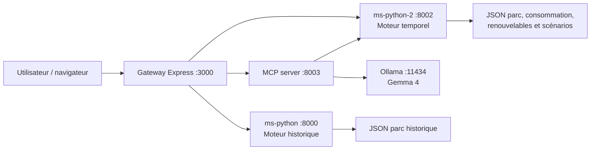
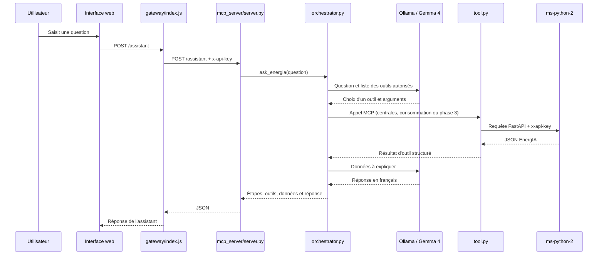

# EnergIA — documentation unifiée

> Documentation de référence du dépôt, établie à partir du code, de `docs/brief.md`, des README existants et de la configuration Docker. Elle ne remplace ni ne modifie les documents historiques ; elle en propose un point d'entrée unique.

## 1. Finalité et périmètre

EnergIA est un système d'aide à la décision qui simule le pilotage du parc nucléaire français. Il est construit en deux itérations :

- le moteur historique répond à une hausse ponctuelle de consommation dans une région ;
- le moteur actuel simule une journée au pas de 15 minutes (96 pas) et conserve l'état du parc d'un pas au suivant.

Le parc nucléaire est la production pilotable. Le solaire et l'éolien sont des productions non pilotables : ils diminuent donc la demande que le nucléaire doit couvrir. Les données du dépôt sont des données de simulation ou de référence, et non des mesures temps réel.

## 2. Architecture d'exécution



La gateway est le point d'entrée HTTP normal. Elle sert également l'interface statique. Les deux services FastAPI protègent leurs routes métier par l'en-tête `x-api-key`, alimenté par `SECURITY_TOKEN`. La gateway et le client MCP ajoutent cet en-tête lors de leurs appels internes.

Pour l'assistant, la chaîne est la suivante : navigateur → `POST /assistant` de la gateway → serveur MCP → sélection d'outils par Gemma 4 → outils MCP → FastAPI phase 1/3 → réponse rédigée par Gemma 4. Le serveur MCP ne refait pas les calculs métier : `tool.py` récupère les données auprès de `ms-python-2`.

### Parcours détaillé de l'assistant



Les responsabilités sont volontairement séparées : `server.py` expose MCP et la route HTTP ; `orchestrator.py` encadre l'échange avec le modèle et limite les tours d'outils ; `tool.py` est le seul client FastAPI du serveur MCP ; `ollama_client.py` appelle Ollama. Ainsi, Gemma 4 interprète les résultats mais ne calcule pas ni ne remplace les données EnergIA.

## 3. Phases fonctionnelles

| Étape | Objectif | Entrées supplémentaires | Règles et résultat |
| --- | --- | --- | --- |
| Prototype initial | Couvrir une hausse isolée dans une région | Région et MW additionnels | Priorité aux centrales locales, puis réseau ; chemins Dijkstra, pertes, capacité, rampes et score déterminent l'allocation. |
| Phase 1 | Simuler une journée entièrement nucléaire | Consommations régionales de référence | 96 états successifs. Les puissances min./max. et les rampes de montée/descente sont respectées à chaque quart d'heure. |
| Phase 2 | Intégrer solaire et éolien | Production non pilotable | Demande nucléaire = consommation − solaire − éolien. Une réserve nucléaire minimale configurable est surveillée. |
| Phase 3 | Perturber la consommation | Scénario et événements | Des deltas MW ou % sont appliqués sur les régions et créneaux concernés, y compris en chevauchement. Les insuffisances sont signalées au pas concerné. |
| Bonus | Exploiter les simulations | Scénarios / durée | Import-export JSON, graphiques KPI et simulation longue (7, 30 ou 365 jours). |

Les objets principaux renvoyés par une simulation comportent notamment le numéro de phase, les pas calculés, l'état des centrales, la demande et production, la réserve, les surplus et les MW manquants. Le détail exact est exposé par l'OpenAPI de `ms-python-2` [docs/](http://localhost:3000/docs/ "Documentation automatique des routes par openAPI").

### Contraintes conservées par le moteur

- La sortie d'un quart d'heure devient l'état initial du quart d'heure suivant.
- Une centrale indisponible ne contribue pas ; une centrale ne dépasse pas ses limites de puissance.
- Toute variation est bornée par les rampes de montée et de descente sur 15 minutes.
- L'allocation prend en compte les capacités de liaison, les distances, les pertes et la priorité régionale.
- Une demande non satisfaite ou une réserve inférieure au minimum configuré est une situation dégradée explicitement identifiable.

## 4. Structure du dépôt

| Emplacement | Rôle |
| --- | --- |
| `gateway/` | Gateway Node.js/Express, routage, interface web et proxy vers les services. |
| `gateway/public/` | Page HTML, styles et validations côté navigateur ; `index-sauvegarde.html` est une sauvegarde. |
| `ms-python/` | Première version FastAPI : prescription régionale ponctuelle. |
| `ms-python-2/` | Service FastAPI principal, moteur temporel des phases 1 à 3, données et tests, expositions des outils et fonctions pour Ollama et le serveur MCP. |
| `mcp_server/` | Serveur FastMCP, outils/ressources, orchestration LLM et client FastAPI. |
| `llm/` | Volume d'exécution Ollama (modèles, cache et historique) ; ne pas y versionner de secret. |
| `docs/` | Brief pédagogique, documents d'architecture, captures et documentation de tests API. |
| `docker-compose*.yml` | Orchestration standard, construction locale et variante GPU. |

### Moteur temporel (`ms-python-2/services/`)

| Module | Responsabilité |
| --- | --- |
| `graph_loader.py` | Charge et valide les JSON, indexe régions/centrales et construit le graphe. |
| `nuclear_dataframe.py` | Fusionne parc et paramètres temporels dans une DataFrame. |
| `temporal_engine.py` | Initialise l'état, calcule un pas puis enchaîne la journée. |
| `temporal_allocation.py` | Répartit les variations de puissance entre régions et conserve l'état. |
| `allocation.py`, `candidates.py`, `priority.py`, `score.py`, `capacity.py`, `dijkstra.py` | Briques de sélection, capacité, cheminement et allocation héritées/étendues du moteur initial. |
| `apply_consumption_events.py` | Active les événements et applique les variations de consommation. |
| `scenario_json.py` | Valide, importe et exporte les scénarios. |
| `charts.py`, `long_simulation.py` | Bonus : courbes phase 2 et période longue. |
| `energia_service.py`, `dispatch.py` | Façade et fonction de répartition expérimentales/historiques ; le flux MCP courant passe par FastAPI. |

### Données versionnées

Les jeux de données du moteur actuel se trouvent dans `ms-python-2/data/` :

- `parc_nucleaire_prescriptif_france.json` : centrales, régions, liaisons et paramètres de simulation ;
- `energia-journee-reference-consommation.json` : 96 horaires, consommation nationale et régionale ;
- `energia-parametres-temporels-nucleaire.json` : état initial, bornes de puissance, disponibilités et rampes ;
- `energia-production-non-pilotable.json` : solaire et éolien nationaux/régionaux ;
- `energia-scenarios-phase3-exemples.json` : scénarios et événements de phase 3.

`exported_scenarios/` et `generated_charts/` contiennent des sorties bonus déjà générées.

## 5. Prérequis et configuration

- Docker Desktop et Docker Compose ;
- pour un lancement hors conteneur : Node.js 24 (image gateway) et Python 3.12 (images FastAPI/MCP) ;
- Ollama et le modèle configuré, actuellement `gemma4:e4b`, pour l'assistant ;
- un fichier `.env` à la racine. Il est ignoré par Git : ne jamais copier sa valeur de `SECURITY_TOKEN` dans un document, un commit ou une commande partagée.

Variables attendues (valeurs indicatives, sans secret) :

```bash
GATEWAY_PORT=3000
PYTHON_PORT=8000
PYTHON_PORT_2=8002
MCP_PORT_3=8003
PYTHON_SERVICE_URL=http://ms-python:8000
PYTHON_SERVICE_URL_2=http://ms-python-2:8002
PYTHON_MCP_URL=http://mcp-server:8003
MCP_URL=http://mcp-server:8003/mcp
OLLAMA_HOST=http://llm:11434
OLLAMA_MODEL=gemma4:e4b
SECURITY_TOKEN=<secret-local>
```

Les noms de services Docker ne fonctionnent qu'à l'intérieur du réseau Compose. Depuis la machine hôte, utiliser `127.0.0.1` avec les ports publiés.

## 6. Démarrage et arrêt

Depuis la racine du dépôt :

```bash
docker compose build
docker compose up -d
docker compose ps
```

Les cinq conteneurs attendus sont `gateway`, `ms-python`, `ms-python-2`, `llm` et `mcp-server`. Ouvrir ensuite [http://127.0.0.1:3000](http://127.0.0.1:3000).

Pour arrêter l'ensemble :

```bash
docker compose down
```

La configuration Compose principale utilise des images publiées pour les deux microservices Python ; `docker-compose.override.yml` les remplace par des builds locaux. Les deux fichiers sont automatiquement combinés par `docker compose` lorsqu'ils sont présents.

Pour activer la prise en charge des GPUs par Ollama, composer explicitement la variante après avoir décommenté la partie qui vouos intéresse :

```bash
docker compose -f docker-compose.yml -f docker-compose.gpu_or_cpu.yml up -d --build
```

Pour reconstruire entièrement les images avant démarrage, notamment après un changement de configuration Compose :

```bash
docker compose -f docker-compose.yml -f docker-compose.gpu_or_cpu.yml build --no-cache
docker compose -f docker-compose.yml -f docker-compose.gpu_or_cpu.yml up -d
```

Après une modification, reconstruire le seul service concerné, par exemple :

```powershell
docker compose build mcp-server
docker compose up -d --force-recreate mcp-server
```

Pour reconstruire chaque image individuellement à partir du dockerfile afin de générer une image personnalisée qui est ensuite envoyée vers le registre DockerHub :
_prenons exemple pour le service de passerelle (gateway), en travaillant à partir de la racine du projet_

```bash
cd ./gateway
docker build -t <dockerUsername>/energia-gateway .
docker push <dockerUsername>/energia-gateway
```

## 7. Vérifications opérationnelles

```bash
curl http://127.0.0.1:3000/health
curl http://127.0.0.1:8002/health
curl http://127.0.0.1:8003/health
curl http://127.0.0.1:11434/api/tags
docker compose exec llm ollama list
docker compose exec mcp-server python -c "import tool; print(tool.get_plants()['plants_count'])"
```

Le dernier contrôle valide le trajet MCP → FastAPI et retourne actuellement le nombre de centrales chargé. En cas d'erreur, consulter les journaux ciblés :

```powershell
docker compose logs --tail=100 gateway
docker compose logs --tail=100 ms-python-2
docker compose logs --tail=100 mcp-server
docker compose logs -f llm
```

Si le modèle attendu n'apparaît pas dans la liste Ollama, le récupérer puis vérifier une inférence minimale :

```powershell
docker compose exec llm ollama pull gemma4:e4b
docker compose exec llm ollama run gemma4:e4b "Réponds uniquement par ok"
```

Les contrôles de santé attendus sont `status: ok` pour FastAPI (avec les phases `1`, `2`, `3`) et pour le serveur MCP (`service: EnergIA MCP Server`).

## 8. API HTTP

### Entrée publique : gateway

| Méthode et route | Cible | Usage |
| --- | --- | --- |
| `GET /health` | gateway | État de la passerelle. |
| `GET /health-ms` | `ms-python` | État du moteur historique. |
| `GET /health-ms-2` | `ms-python-2` | État du moteur temporel. |
| `GET /plants`, `/regions`, `/network` | `ms-python` | Consultation du prototype. |
| `POST /simulate` | `ms-python` | Simulation historique ; corps : `{"region":"occitanie","additional_demand_mw":500}`. |
| `GET /phase1/plants` | `ms-python-2` | Parc et contraintes temporelles. |
| `GET /phase1/consumption` | `ms-python-2` | Les 96 consommations de référence. |
| `GET /phase1/simulate-day` | `ms-python-2` | Simulation phase 1. |
| `GET /phase2/simulate-day` | `ms-python-2` | Simulation phase 2. |
| `GET /phase3/simulate-day` | `ms-python-2` | Simulation phase 3. |
| `POST /assistant` | MCP | Corps : `{"question":"…"}`. |

Les réponses repassant par le gateway ont l'enveloppe `{"success": true, "response": …}`. La gateway ne transmet pas actuellement les paramètres de requête des routes de simulation : via celle-ci, les valeurs par défaut sont donc utilisées.

### API directe du moteur temporel `:8002`

Ces routes sont destinées au diagnostic et requièrent `x-api-key: <SECURITY_TOKEN>` sauf `/` et `/health`.

| Route | Paramètres | Défaut |
| --- | --- | --- |
| `GET /phase1/plants` | — | — |
| `GET /phase1/consumption` | — | 96 pas de 15 min. |
| `GET /phase2/non-dispatchable-production` | — | 96 pas de 15 min. |
| `GET /phase1/simulate-day` | `number_of_steps` (1–96) | 96 |
| `GET /phase2/simulate-day` | `number_of_steps` (1–96), `minimum_reserve_mw` (≥ 0) | 96, 5000 MW |
| `GET /phase3/simulate-day` | paramètres phase 2 + `scenario_id` | `evening_peak_occitanie` |

La documentation OpenAPI générée est disponible à `http://127.0.0.1:8002/docs` ; celle du prototype (ponctuel régional) à `http://127.0.0.1:8000/docs`.

## 9. MCP et assistant

Le serveur MCP expose les outils `list_plants`, `get_consumption(region_id, timestamp)` et `simulate_phase3(scenario_id, number_of_steps, minimum_reserve_mw)`, ainsi que les ressources :

```py
energia://plants
energia://consumption/{region_id}/{timestamp}
energia://phase3/{scenario_id}/{number_of_steps}/{minimum_reserve_mw}
```

Pour tester le flux conversationnel dans le conteneur :

```powershell
docker compose exec -it mcp-server python orchestrator.py
```

Le modèle peut choisir un ou plusieurs outils, jusqu'à trois tours d'appel. Les résultats structurés proviennent de FastAPI ; Gemma 4 les formule en langage naturel. Une réponse LLM peut varier : elle ne constitue pas une mesure métier indépendante des données retournées.

Pour l'inspection locale du protocole MCP, se placer dans `mcp_server/`, activer l'environnement Python et définir `PYTHON_SERVICE_URL_2=http://127.0.0.1:8002` avant de lancer `mcp dev server.py`.

Exemple de test dans MCP Inspector, onglet **Tools**, pour vérifier le trajet vers FastAPI :

```json
{
  "region_id": "occitanie",
  "timestamp": "16:00"
}
```

Cet appel de `get_consumption` doit retourner la consommation de référence demandée. Les onglets **Resources** permettent également de vérifier les URI `energia://…`. Si l'inspecteur n'est pas disponible via `mcp`, il peut être lancé avec `npx @modelcontextprotocol/inspector`.

## 10. Tests et sorties bonus

Exécuter les tests du moteur temporel depuis son dossier ou dans son conteneur :

```powershell
docker compose exec ms-python-2 python -m unittest discover -s tests -p "test_*.py" -v
docker compose exec ms-python python -m unittest discover -s tests -v
```

Les tests couvrent notamment le cheminement, les capacités, l'allocation, la DataFrame nucléaire, les trois phases temporelles et la façade `energia_service`. Les tests MCP automatisés ne sont pas encore présents.

Depuis `ms-python-2/`, les bonus s'exécutent ainsi :

```powershell
python -m services.charts
python -m services.long_simulation --days 7
python -m services.long_simulation --days 30
python -m services.long_simulation --days 365 --scenario-id evening_peak_occitanie
```

## 11. Limites et points d'attention connus

- Les séries de consommation, renouvelables et scénarios sont simulées/de référence ; elles ne sont pas alimentées en temps réel.
- Le format des sorties de simulation longue et phase 3 peut être volumineux, en particulier sur 96 pas ou davantage.
- Les routes de simulation de la gateway utilisent les paramètres par défaut, car elle n'effectue pas de relais de `req.query` vers FastAPI.
- L'assistant dépend de la disponibilité d'Ollama et du modèle `gemma4:e4b` ; ses formulations restent probabilistes, même si les données appelées sont contrôlées.
- `llm/` peut contenir des modèles volumineux, de l'historique et une clé SSH locale : il doit rester ignoré et non diffusé.
- Plusieurs documents et composants conservent les étapes historiques du projet. Le moteur à privilégier pour les phases 1–3 est `ms-python-2`.

## 12. Documentation existante et statut

| Document | Utilité |
| --- | --- |
| `docs/brief.md` | Cahier des charges pédagogique des trois phases. |
| [`DEPLOIEMENT-INITIAL.md`](./DEPLOIEMENT-INITIAL.md) | Documentation détaillée du prototype et des routes initiales. |
| [`DEPLOIEMENT-PHASES.md`](./DEPLOIEMENT-PHASES.md) | Détails d'implémentation et résultats des phases temporelles. |
| [`DEPLOIEMENT-LLM.md`](./DEPLOIEMENT-LLM.md) | Variante CPU/GPU pour le service Ollama. |
| [`DEMARRAGE-PROJET-ENERGIA.md`](./DEMARRAGE-PROJET-ENERGIA.md)`DEMARRAGE-PROJET-ENERGIA.md` | Procédure de démarrage, vérification et diagnostic. |
| [`README.md`](./README.md) | Présentation de l'architecture actuelle et du flux assistant. |
| `docs/architecture_et_flux/README.md` | Réflexion d'architecture, flux, sources et MLOps. |

Cette documentation est le point de départ recommandé ; les documents ci-dessus restent les sources de détail et d'historique.
