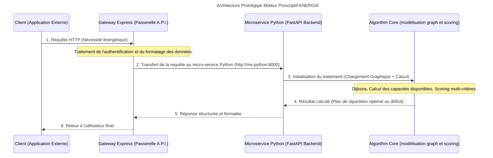

# Projet ENERGIA : Système d'aide à la décision pour le pilotage de parc nucléaire

Ce projet est une intervention complète visant à moderniser le système d'aide à la décision (SAD) d'un grand compte du secteur de l'énergie. Son objectif principal est de déterminer, en temps réel et de manière optimale, un ajustement des ressources de production capable de satisfaire les besoins énergétiques fluctuants observés sur le réseau électrique français, ou de quantifier précisément le déficit en cas d'impossibilité de couverture. La production d'électricité est assurée, immuablement, par les parcs éoliens et solaires. La production assurée par le parc nucléaire est pilotable et sert donc de variable d'ajustement quant à la couverture du besoin.

## Table des matières

- [[#Architecture globale|Architecture globale]]
	- [[#Architecture globale#Schéma de flux séquentiel|Schéma de flux séquentiel]]
	- [[#Architecture globale#Arborescence projet|Arborescence projet]]
- [[#Application|Application]]
	- [[#Application#Routes|Routes]]
		- [[#Routes#**Routes de monitoring**|**Routes de monitoring**]]
		- [[#Routes#**Routes d'opérations**|**Routes d'opérations**]]
	- [[#Application#Composants techniques principaux|Composants techniques principaux]]
		- [[#Composants techniques principaux#Fonctionnement du moteur prescriptif|Fonctionnement du moteur prescriptif]]
			- [[#Fonctionnement du moteur prescriptif#Formule d'attribution de score|Formule d'attribution de score]]
			- [[#Fonctionnement du moteur prescriptif#ms-python/services/**graph_loader.py**|ms-python/services/**graph_loader.py**]]
			- [[#Fonctionnement du moteur prescriptif#ms-python/services/**dijkstra.py**|ms-python/services/**dijkstra.py**]]
			- [[#Fonctionnement du moteur prescriptif#ms-python/services/**capacity.py**|ms-python/services/**capacity.py**]]
			- [[#Fonctionnement du moteur prescriptif#ms-python/services/**priority.py**|ms-python/services/**priority.py**]]
			- [[#Fonctionnement du moteur prescriptif#ms-python/services/**candidates.py**|ms-python/services/**candidates.py**]]
			- [[#Fonctionnement du moteur prescriptif#ms-python/services/**score.py**|ms-python/services/**score.py**]]
			- [[#Fonctionnement du moteur prescriptif#ms-python/services/**allocation.py**|ms-python/services/**allocation.py**]]
	- [[#Application#Données utilisées|Données utilisées]]
	- [[#Application#Méthodologie algorithmique détaillée|Méthodologie algorithmique détaillée]]
	- [[#Application#Tests Unitaires|Tests Unitaires]]
- [[#Démarrage et utilisation|Démarrage et utilisation]]
	- [[#Démarrage et utilisation#Prérequis techniques|Prérequis techniques]]
	- [[#Démarrage et utilisation#Lancement de l'environnement (via Docker)|Lancement de l'environnement (via Docker)]]
	- [[#Démarrage et utilisation#Terminaisons _(Endpoints)_ de l'API  exposé(e)s|Terminaisons _(Endpoints)_ de l'API  exposé(e)s]]

## Architecture globale

Ce système d'information est conçu selon une architecture orientée micro-services pour garantir la scalabilité et l'isolation des préoccupations (_separation of concerns_). Le flux de données suit un chemin strict, passant toujours par une passerelle unique.

### Schéma de flux séquentiel



### Arborescence projet


Dépôt GitHub : https://github.com/tomtoomuch/energIA

Image de la passerelle : https://hub.docker.com/r/tomtoomuch/energia-gateway

Image du micro-service 'Moteur prescriptif' : https://hub.docker.com/r/tomtoomuch/energia-ms-python

## Application

### Routes

Notre API expose 6 routes sur la passerelle (_gateway_) qui écoute le port 3000.
Les routes sont documentées ci-dessous.
Par ailleurs, vous pouvez trouver la [documentation générée avec Bruno](./docs/Tests-EnergIA-documentation.html "Documentation générée par Bruno sur les tests de routes de notre API") après avoir tester le fonctionnement des différentes routes exposées.
De plus, FastAPI documente automatiquement les routes exposées via openAPI et [cette documentation sur une page html](http://localhost:8000/docs").

#### **Routes de monitoring**

##### GET /health

GET <http://localhost:3000/health>

Interroge le serveur passerelle et vérifie son fonctionnement.

##### GET /health-ms

GET <http://localhost:3000/health-ms>

Interroge le serveur python/FastAPI (port 8000) sur son _endpoint_ /health via la passerelle et répond au client via la passerelle également et vérifie son fonctionnement.
<!-- AMELIORATION : Prévoir d'afficher un·e page/onglet/surcouche modale qui affiche l'état du réseau et de ses éléments. On peu y ajouter les métriques des conteneurs -->

#### **Routes d'opérations**

GET <http://localhost:3000/plants>

Envoie une requête au micro-service du moteur prescriptif pour extraire et traiter les données pour afficher la liste des centrales électriques du parc nucléaire français métropolitain.

GET <http://localhost:3000/regions>

Envoie une requête au micro-service du moteur prescriptif pour extraire et traiter les données pour afficher la liste des régions nomenclaturés, du parc français nucléaire métropolitain.

GET <http://localhost:3000/network> <!-- grid serait plus juste -->

Envoie une requête au micro-service du moteur prescriptif pour extraire et traiter les données qui servent à fabriquer le modèle en _graph_ pour afficher le réseau des centrales du parc nucléaire français.

POST <http://localhost:3000/simulate>

Envoie une requête au micro-service du moteur prescriptif pour lancer l'exécution des scripts du moteur prescriptif qui simule unen demande liée à une hausse de consommation d'une région.

```json
body: {
 "region": "occitanie",
 "additional_demand_mw": 500
}
```

Port 8000 (service Python direct) — réservé au debug uniquement, pas pour l'usage normal :

GET <http://localhost:8000/health> (pas de clé nécessaire)

GET <http://localhost:8000/plants> -H "X-Api-Key: <SECURITY_TOKEN>"

Le format des réponses json

```json
{ 
 "success": true,
 "response": {
  "allocations": [
   {
    "plant_id": "golfech",
    "allocated_mw": 89.0,
    "final_load_ratio": 0.95,
    "path": ["golfech"],
    "distance_km": 0.0,
    "loss_percent": 0.0,
    "score": -160.02
   }
  ],
  "missing_mw": 0.0,
  "fully_satisfied": true
 }
}
```

### Composants techniques principaux

* **Gateway Express (gateway/) :** la passerelle API (NodeJS/Express).
C'est le seul point d'entrée autorisé pour tout client externe. Elle gère le routage, la validation des requêtes et assure que les communications internes se font via un protocole strict vers le backend Python.

* **Service Python (ms-python/) :** le cœur de la logique métier.
Ce micro-service implémente l'ensemble des calculs complexes : modélisation du réseau, algorithmes de cheminement et d'optimisation. Il est construit en utilisant FastAPI pour exposer ses fonctionnalités via une API REST interne.

* **Moteur algorithmique prescriptif (ms_python/) :** les traitements lourds
**Modélisation :** Traitement des données du parc nucléaire (_nodes_/sommets = centrales, _edges_/arêtes = liaisons).
**Optimisation de cheminement :** Implémentation de l'algorithme de Dijkstra pour trouver le chemin le plus court entre deux points dans le réseau maillé.
**Calcul des capacités disponibles :** Détermination de la puissance disponible en fonction du minimum entre les limites supérieures (_soft upper bound_) et la rampe de montée maximale (_max_ramp_up_mw_per_15_min_).

#### Fonctionnement du moteur prescriptif

Le moteur reçoit une région et une demande en MW, et répond en 4 étapes :

1. D'abord il regarde les centrales locales de la région (priority.py) — elles sont examinées en premier, comme demandé par le brief. Si elles ne suffisent pas, il explore le reste du réseau national avec Dijkstra (dijkstra.py), pour connaître la distance et les pertes vers chaque autre centrale accessible.
2. Ensuite chaque centrale candidate reçoit une note (score.py) qui combine distance, pertes, saturation et priorité régionale.
3. Enfin, allocation.py répartit la demande petit à petit :
    - à chaque tour, il prend la centrale avec la meilleure note, lui donne le maximum qu'elle peut fournir (plafonné par sa marge, sa vitesse de montée en puissance, et la capacité de la liaison empruntée),
    - puis recommence avec ce qu'il reste à couvrir - jusqu'à ce que la demande soit entièrement satisfaite, ou qu'il n'y ait plus aucune centrale disponible.

##### Formule d'attribution de score

```py
score = distance_km × 1.0 + pertes_% × 45.0 + (taux_de_charge_final ^ 4) × 900.0 + pénalité_technique × 200.0 − 250[^1]
```

Plus le score est bas, plus la centrale est intéressante. La distance et les pertes pénalisent linéairement - plus loin ou plus de pertes, pire c'est, mais sans effet de seuil brutal.
Le taux de charge final est élevé à la puissance 4 délibérément : ça reste presque neutre pour une centrale à moitié chargée (facteur ≈ 0.06), mais explose pour une centrale presque saturée (facteur ≈ 0.81 à 95%) — exactement ce que demande le brief ("une centrale presque saturée devra être moins intéressante").
Le bonus régional (-250) fait qu'une centrale locale part avec un avantage qu'une distance ou des pertes modérées ne suffisent généralement pas à compenser
Les centrales de la région sont donc presque toujours choisies en premier, sauf si elles sont vraiment trop saturées.
Tous ces poids ne sont pas choisis au hasard : ils sont lus directement depuis _simulation_parameters_ dans le [JSON fourni par le brief](./data/parc_nucleaire_prescriptif_france.json "Fichier de données fourni pour lel travail de prototypagee").

##### ms-python/services/**graph_loader.py**

Ce fichier transforme les données brutes du JSON (centrales, liaisons) en une structure que le programme peut utiliser facilement pour calculer des chemins - un graphe

- **load_data(path) :** ouvre le fichier JSON et le transforme en dictionnaire Python. Rien de plus qu'une lecture de fichier.

- **build_graph(data) :** c'est la partie importante. Elle prend les liaisons du JSON (_plant_edges_) et construit un dictionnaire où chaque centrale connaît la liste de ses voisins directs, avec pour chacun la distance, les pertes, et la capacité de la liaison. Comme chaque liaison va dans les deux sens, elle l'ajoute deux fois (une fois pour chaque centrale concernée) - sinon on pourrait aller de A vers B mais pas l'inverse.

- **build_plants_index(data)** et **build_regions_index(data) :** deux dictionnaires bonus, pour retrouver rapidement les infos complètes d'une centrale ou d'une région à partir de son identifiant, sans reparcourir toute la liste à chaque fois. Utile pour les étapes suivantes (calcul de marge, priorité locale).

>Ce fichier n'intègre ni FastAPI ni les routes HTTP - il ne fait que manipuler des données, dans le respect du principe de séparation des responsabilités. C'est ce que le brief demande ("le code algorithmique séparé des routes HTTP"), et ça permet de le tester tout seul, sans lancer le serveur.
>
>Pour tester, lancer un terminal et appeler :

 ```bash
 python graph_loader.py
 ```

##### ms-python/services/**dijkstra.py**

Ce fichier trouve le chemin le moins cher (_ou chemin le plus court_) entre deux centrales, en passant par le réseau de liaisons - c'est l'algorithme de Dijkstra, qu'on a écrit nous-mêmes sans bibliothèque.

1. On part d'une centrale de départ. On ne connaît encore la distance vers aucune autre centrale (distance "infinie" pour toutes, sauf 0 pour le départ).
2. Ensuite, à chaque tour, on va toujours voir en premier la centrale la plus proche qu'on connaît déjà - jamais une piste au hasard.
3. À partir de cette centrale, on regarde ses voisins directs dans le graphe : si passer par elle donne un chemin plus court que ce qu'on savait avant, on met à jour la distance.
4. On répète ça jusqu'à avoir atteint la centrale d'arrivée, ou jusqu'à ne plus pouvoir avancer.

**3 variables à connaître**
 **distances :** la meilleure distance connue jusqu'ici pour chaque centrale.
 **previous :** par quelle centrale on est passé juste avant, pour pouvoir reconstruire le chemin  complet à la fin (sinon on connaît juste la distance, pas le trajet).
 **visited :** les centrales déjà "réglées", pour ne pas repasser dessus inutilement.

**1 fonction**
 **shortest_paths_from :** au lieu de chercher le chemin vers une seule centrale, cette fonction calcule d'un coup le chemin le plus court vers toutes les centrales atteignables depuis un point de départ

##### ms-python/services/**capacity.py**

Ce fichier calcule combien de MW en plus chaque centrale peut encore produire, avant d'atteindre sa limite de sécurité.

Chaque centrale a une limite haute qu'elle ne doit jamais dépasser (_soft_upper_bound_mw_ - fixée à 95% de sa puissance installée - une marge de sécurité).
Elle a aussi une production actuelle (_initial_output_mw_). La différence entre les deux, c'est ce qu'elle peut encore distribuer : marge = limite − production actuelle.

Pourquoi on garde _ramp_limit_ séparée : une centrale peut avoir beaucoup de marge (par exemple 600 MW), mais elle ne peut pas monter en puissance instantanément - elle a une vitesse maximale de montée par tranche de 15 minutes (_max_ramp_up_mw_per_15_min_). On garde cette info à part pour l'instant, parce qu'elle servira plus tard, quand on répartira vraiment la demande entre les centrales (on ne pourra jamais dépasser ni la marge, ni la rampe).

Le cas d'une centrale indisponible : si _available_ est à ```False``` dans le JSON, la fonction retourne 0 directement - on ne peut rien demander à une centrale hors service, peu importe sa marge théorique.

Le fichier JSON contient déjà, pour chaque centrale, un champ _initial_dispatchable_margin_mw_ - une valeur de référence. Notre fonction _dispatchable_margin_ doit retourner exactement ce nombre. Par exemple pour Golfech, le JSON dit 89, et notre fonction doit donner 89.0. C'est une vérification simple qui montre que notre calcul retombe sur les chiffres officiels du jeu de données.

##### ms-python/services/**priority.py**

Ce fichier décide dans quel ordre chercher des centrales pour une région donnée :
d'abord chez elle, ensuite les voisines les plus évidentes.

**t_region(regions_index, region_id) :** retrouve une région complète à partir de son identifiant (par exemple "Occitanie"). _regions_index_ est le dictionnaire {id: région} qu'on construit avec _build_regions_index_ (déjà mobilisée dans ```graph_loader.py```). Si l'_id_ n'existe pas, on lève une erreur claire plutôt que de planter avec un message incompréhensible.

**local_plant_ids(region) :** retourne juste la liste _local_plant_ids_ du JSON - les centrales physiquement situées dans cette région. Ce sont elles qu'il faut regarder en priorité selon le brief.

**external_entry_plant_ids(region) :** retourne _external_entry_plant_ids_ - les centrales voisines, pré-identifiées dans le JSON comme "point d'entrée" pratique pour cette région, à regarder en second si les centrales locales ne suffisent pas.

**candidate_search_order(region) :** la fonction la plus importante ici. Elle assemble les deux listes précédentes, dans l'ordre (locale d'abord, externe ensuite), et retire les doublons si jamais une centrale apparaissait dans les deux listes. Résultat : une seule liste, dans le bon ordre de priorité, prête à être utilisée par la suite (calcul du score, répartition).

Le bloc de point d'entrée contient actuellement un test à la main sur deux régions différentes.

```py
 if __name__ == "__main__"
```

Pour l'Occitanie, qui a Golfech comme unique centrale locale, l'ordre doit être \['golfech', 'tricastin', 'cruas', 'saint_alban'].
Pour l'Île-de-France, qui n'a aucune centrale locale (regarde _local_plant_ids: \[]_ dans le JSON), l'ordre de recherche commence directement par les centrales externes \['nogent', 'dampierre', 'saint_laurent']. C'est un aspect fondamental du brief : certaines régions n'ont pas de centrale sur leur territoire, il faut quand même pouvoir répondre à la demande des populations.

##### ms-python/services/**candidates.py**

Ce fichier donne, pour une région donnée, la liste complète des centrales candidates avec leur distance et leurs pertes - en combinant les centrales locales, les centrales d'entrée externes, et le reste du graphe si besoin. Avant, nous exécutions deux briques séparées mais aucune ne suffisait seule. **priority.py** savait dire _"regarde d'abord les centrales locales, puis les externes"_ - mais s'arrêtait là, sans jamais chercher plus loin dans le réseau si ces deux
listes ne suffisaient pas. dijkstra.py savait calculer des distances et des chemins, mais seulement si on lui donnait déjà un point de départ et une cible précise.
**candidates.py** relie les deux : il utilise **priority.py** pour savoir par où
commencer, et _dijkstra.shortest_paths_from_ pour explorer tout le reste du graphe automatiquement.

**La fonction region_candidates**
D'abord, elle prend toutes les centrales locales de la région et leur donne une distance de 0 et des pertes de 0 - notre logique veut que comme elles sont déjà sur place, pas besoin de les transporter sur le réseau.

Ensuite, elle détermine les "points de départ" (_anchors_) pour explorer le reste du graphe :
les centrales locales de la région si elle en a, sinon ses centrales d'entrée externes
(cas d'une région comme l'Île-de-France, qui n'a aucune centrale chez elle).

Pour chaque point de départ, elle lance **shortest_paths_from** - qui donne d'un coup la distance vers toutes les autres centrales du pays. Elle ajoute chaque centrale trouvée à la liste des candidates, avec sa distance et ses pertes. Si plusieurs points de départ permettent d'atteindre la même centrale, elle garde la distance la plus courte trouvée.

```py
if plant_id not in candidates or info["distance_km"] < '...':
```

Notre logique veut que nous comparions la meilleure option disponible, pas une option au hasard.

##### ms-python/services/**score.py**

Script attribue un score à chaque centrale en fonction du point de départ. Plus le score d'un nœud est bas, plus ce nœud est intéressant comme étape dans le chemin.

###### Eléments impactant le score à la hausse

- Une **distance** trop importante impacte fortement la note → plus il y a de km de distance, plus le score est élevée.
- Les **déperditions de puissance** entraîne une forte hausse du score, elles sont liées à la distance.
- La **fourniture possible** est trop proche de sa limite → le score monte beaucoup, parce qu'on met cette valeur à la puissance 4.
- Un **problème technique**, plus rare dans le cas qui nous occupe.

_Le brief demande justement d'éviter les centrales presque saturées._

###### Eléments impactant le score à la baisse

- Une **distance** faible, si la centrale se trouve dans la région demandeuse → on enlève 250 points à son score.

##### ms-python/services/**allocation.py**

Ce fichier décide, MW par MW, quelles centrales vont produire plus, et combien chacune - comme un responsable qui distribue une commande entre plusieurs fournisseurs, en prenant toujours le meilleur d'abord.
Le script prend en entrée une demande d'énergie électrique à couvrir (par exemple 1200 MW pour l'Occitanie).
On regarde toutes les centrales candidates, on donne un score à chacune (grâce à score.py),
et on choisit la meilleure. On lui donne le maximum qu'elle peut fournir - pas plus que sa marge, ni plus que sa vitesse de montée en puissance (_ramp_), et pas plus que ce que la liaison électrique peut transporter. Puis on regarde ce qu'il reste à couvrir, et on recommence avec les centrales restantes, jusqu'à ce que la demande soit entièrement couverte, ou qu'il n'y ait plus de centrale disponible.

Les **3 plafonds** qu'on ne dépasse jamais, à bien retenir :

* la marge de la centrale (elle ne peut pas produire plus que sa limite de sécurité),
* la montée en puissance, ou _ramp_ in english (elle ne peut pas monter en puissance instantanément),
* la capacité de la liaison empruntée

### Données utilisées

Les données sont structurées autour des trois piliers suivants :

* **Graphe du réseau :** Représentation physique des centrales et liaisons (pondérées par la distance, les pertes techniques et la capacité maximale).
* **Données géographiques :** Incluant la segmentation en régions et un inventaire de centrales.
* **Besoin régional :** Le flux d'entrée qui déclenche toute simulation (le besoin en MW).

### Méthodologie algorithmique détaillée

L'algorithme principal est une cascade séquentielle de calculs visant à produire le plan optimal avec le score minimal.

**Priorisation des sources :** La recherche priorise toujours les centrales locales (dans la région qui demande) avant d'explorer tout le graphe en respectant l'algorithme de Dijkstra, garantissant une logique opérationnelle terrain.

**Calcul du score global :** Chaque centrale candidate reçoit un score composite pour évaluer son rôle dans la réponse énergétique :

```py
text{Score} = (\text{Distance}_{\text{km}} \times 1.0) + (\text{Pertes}_{\%} \times 45.0) + ((\text{Taux de Charge Final})^4 \times 900.0) + \text{Pénalité technique} \times 200.0 - [250 \text{ si centrale locale}
```

Le plus petit score indique la candidate la plus performante pour répondre au besoin global.

**Répartition de la demande :** Les candidates sont triées par **ordre croissant de leur score**. La demande est ensuite distribuée séquentiellement à chaque centrale, en respectant sa marge disponible (sans dépasser ni le plafond ni les limites des liaisons).

**Cas d'échec :** Si le total cumulé des MW disponibles reste inférieur au besoin initial, le système doit impérativement répondre avec le nombre exact de MW manquants et un message clair.

### Tests Unitaires

Le système doit être robuste et le test des comportements suivants est crucial :

- Satisfaction totale ou partielle de la demande énergétique simulée
- Calcul précis de la capacité disponible en cas de contrainte technique
- Scénario d'absence de chemin viable (connectivité rompue)
- Chemin simple Dijkstra fonctionnel

Pour lancer les tests unitaires sur le micro-service Python :

1. Ouvrez un Terminal depuis le dossier du projet, puis entrez dans le dossier du micro-service

    ```bash
        cd ms-python/
    ```

2. Lancer les tests unitaires

    ```bash
        python -m unittest discover -s tests -v 2> rapport_tests.txt
    ```

3. Le résultat des 5 tests unitaires prévus s'écrit dans le fichier ```rapport_tests.txt```.

## Démarrage et utilisation

### Prérequis techniques

- **Python :** les dépendances spécifiques sont listées dans ms-python/requirements.txt.
- **Node.js :** la passerelle d'API requiert un environnement Node.js actif.

### Lancement de l'environnement (via Docker)

L'environnement complet est géré via le fichier docker-compose.yml à la racine :
    ```bash
    docker compose up --build
    ```

**Ce processus lance simultanément :**

- Le micro-service Python (ms-python) écoutant sur le port 8000 (interne).
- La passerelle Node.js (gateway) écoutant sur le port 3000 (externe).

### Terminaisons _(Endpoints)_ de l'API  exposé(e)s

| Service                   | Endpoint  | Méthode  | Description                                                   |
| ------------------------- | --------- | -------- | ------------------------------------------------------------- |
| Gateway Express - HTML UI | /         | GET/POST | Point d'entrée client pour toute simulation                   |
| ms Python                 | /plants   | GET      | Récupère la liste de toutes les centrales du parc             |
| ms Python                 | /regions  | GET      | Liste des régions géographiques couvertes                     |
| ms Python                 | /network  | GET      | Détails structurels et topologiques du réseau                 |
| ms Python                 | /simulate | POST     | Endpoint principal. Reçoit un besoin énergétique et déclenche |

**Important :**
Le client ne doit **jamais** communiquer directement avec le service Python.
Toute interaction doit passer par la Gateway Express (port 3000).