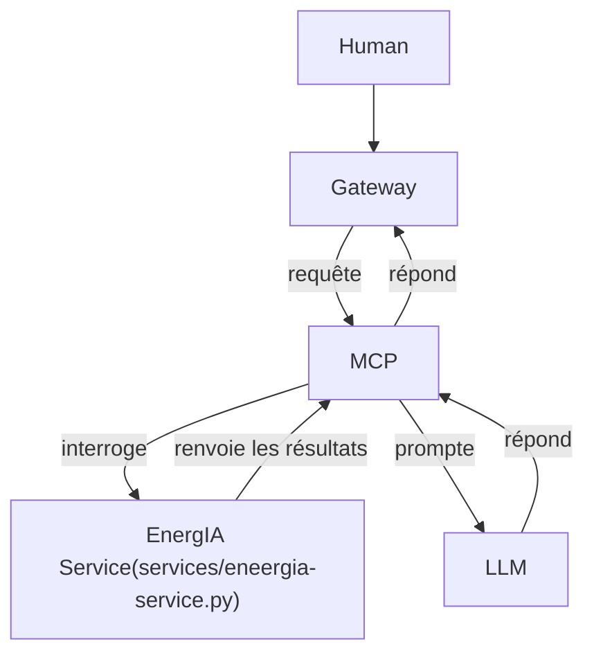

# README LLM




## Changement lancement projet

Afin de solutionner le fait que tous les membres  de l'équipe ne disposent pas de GPU pour faire fonctionner le modèle d'IA, nous avons un docker-compose.yml

Crée le fichier : docker-compose.gpu_or_cpu.yml, dans lequel tu colles le contenu suivant :
```yml
services:
  llm:
#    deploy:
#     resources:
#        limits:
#          cpus: '2'
#
#        reservations:
#          cpus: '1'
    deploy:
      resources:
        reservations:
          devices:
            - driver: nvidia
              count: all
              capabilities: [gpu]
```

tu l'enregistres uis dans un terminal ouvert dans le dossier racine du projet :

```bash
docker compose -f docker-compose.yml -f docker-compose.gpu_or_cpu.yml up -d --build
```
