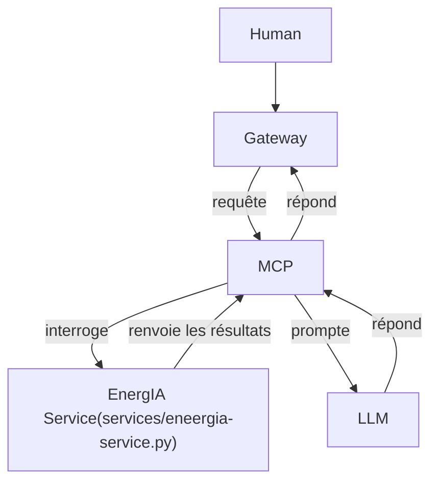

# README LLM

```mermaid
---
config:
  layoout:elk
  theme:redux
---
flowchart TB
    n1["Human"] --> n2["Gateway"]
    n3["MCP"] -- interroge --> n4["EnergIA Service(services/eneergia-service.py)"]
    n3 -- répond --> n2
    n3 -- prompte --> n5["LLM"]
    n5 -- répond --> n3
    n2 -- requête --> n3
    n4 -- renvoie les résultats --> n3

    n1@{ shape: rect}
```
