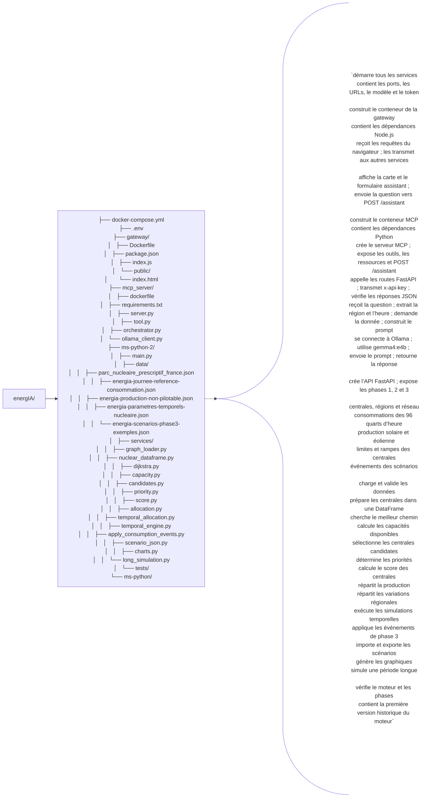

energIA
│
├── docker-compose.yml
│     "démarre tous les services"
│
├── .env
│     "contient les ports les URLs le modèle et le token"
│
├── gateway
│   │
│   ├── Dockerfile
│   │     "construit le conteneur de la gateway"
│   │
│   ├── package.json
│   │     "contient les dépendances node js"
│   │
│   ├── index.js
│   │     "reçoit les requêtes du navigateur"
│   │     "transmet les requêtes aux autres services"
│   │
│   └── public
│       │
│       └── index.html
│             "affiche la carte"
│             "affiche le formulaire assistant"
│             "envoie la question vers POST /assistant"
│
├── mcp_server
│   │
│   ├── dockerfile
│   │     "construit le conteneur MCP""
│   │
│   ├── requirements.txt
│   │     "contient les dépendances python"
│   │
│   ├── server.py
│   │     "crée le serveur MCP"
│   │     "expose les outils MCP"
│   │     "expose les ressources MCP"
│   │     "expose POST /assistant"
│   │
│   ├── tool.py
│   │     "appelle les routes FastAPI"
│   │     "transmet x-api-key"
│   │     "vérifie les réponses JSON"
│   │
│   ├── orchestrator.py
│   │     "reçoit la question"
│   │     "extrait la région et l’heure"
│   │     "demande la donnée à MCP"
│   │     "construit le prompt"
│   │     "demande la réponse à gemma 4"
│   │
│   └── ollama_client.py
│         "se connecte à ollama"
│         "utilise gemma4:e4b"
│         "envoie le prompt"
│         "retourne la réponse"
│
├── ms-python-2
│   │
│   ├── main.py
│   │     "crée l’API FastAPI"
│   │     "expose les phases 1 2 et 3"
│   │
│   ├── data
│   │   │
│   │   ├── parc_nucleaire_prescriptif_france.json
│   │   │     "centrales régions et réseau"
│   │   │
│   │   ├── energia-journee-reference-consommation.json
│   │   │     "consommations des 96 quarts d’heure"
│   │   │
│   │   ├── energia-production-non-pilotable.json
│   │   │     "production solaire et éolienne"
│   │   │
│   │   ├── energia-parametres-temporels-nucleaire.json
│   │   │     "limites et rampes des centrales"
│   │   │
│   │   └── energia-scenarios-phase3-exemples.json
│   │         "événements des scénarios"
│   │
│   ├── services
│   │   │
│   │   ├── graph_loader.py
│   │   │     "charge et valide les données"
│   │   │
│   │   ├── nuclear_dataframe.py
│   │   │     "prépare les centrales dans une DataFrame"
│   │   │
│   │   ├── dijkstra.py
│   │   │     "cherche le meilleur chemin"
│   │   │
│   │   ├── capacity.py
│   │   │     "calcule les capacités disponibles"
│   │   │
│   │   ├── candidates.py
│   │   │     "sélectionne les centrales candidates"
│   │   │
│   │   ├── priority.py
│   │   │     "détermine les priorités"
│   │   │
│   │   ├── score.py
│   │   │     "calcule le score des centrales"
│   │   │
│   │   ├── allocation.py
│   │   │     "répartit la production"
│   │   │
│   │   ├── temporal_allocation.py
│   │   │     "répartit les variations régionales"
│   │   │
│   │   ├── temporal_engine.py
│   │   │     "exécute les simulations temporelles"
│   │   │
│   │   ├── apply_consumption_events.py
│   │   │     "applique les événements de phase 3"
│   │   │
│   │   ├── scenario_json.py
│   │   │     "importe et exporte les scénarios"
│   │   │
│   │   ├── charts.py
│   │   │     "génère les graphiques"
│   │   │
│   │   └── long_simulation.py
│   │         "simule une période longue"
│   │
│   └── tests
│         "vérifie le moteur et les phases"
│
└── ms-python
      "contient la première version historique du moteur"

