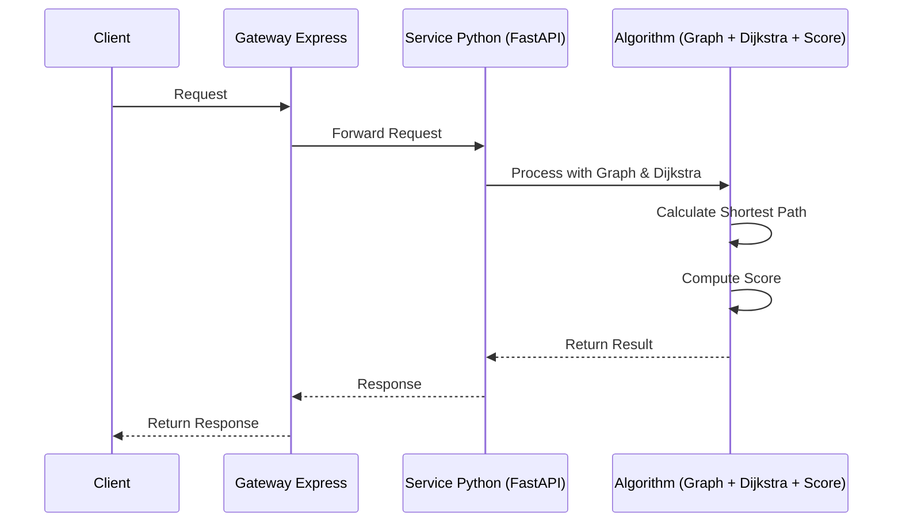

# FEUILLE DE ROUTE - PROJET ENERGIA - _18 étapes_

## Comprendre les données

    18 centrales, 13 régions, 33 liaisons
    consommation / production
    pas des enregistrements : 15 minnutes

## Comprendre les deux projets

    2. gateway/
       (fichier principal : index.js)
    3. ms-python/
	   (fichier principal : main.py, technologie : FastAPI)

## Docker

**docker-compose.yml** lance :
* la passerelle nodejs/express 'gateway' qui écoute les requêtes sur le port 3000 
* le micro-service Python qui écoute le port 8000.
_.env et .env.example créés._

Tester avec 
```
docker compose up --build
```
## Faire communiquer les deux services

Le navigateur envoie une requête HTTP à la passerelle (/gateway)
```
http://localhost:3000
```
La passerelle envoie, à son tour, une requête au micro-service Python avec
```
http://ms-python:8000 — jamais localhost:8000
```

## Charger le JSON

Fichier JSON ms-python/data/parc_nucleaire_prescriptif_france.json.
créer un fichier Python (ex. ms-python/graph_loader.py) qui charge ce JSON et affiche les 3 nombres pour vérifier.
## Construire le graphe

Chaque centrale = un sommet. Chaque liaison (plant_edges) = une arête avec un poids (distance, pertes, capacité max).

## Programmer Dijkstra 

Fichier séparé des routes (ex. ms-python/services/dijkstra.py). Entrée : graphe + centrale de départ + centrale d'arrivée. Sortie : chemin le plus court, ou message clair si aucun chemin n'existe.

## Calculer la puissance disponible 

disponible = minimum(soft_upper_bound_mw − initial_output_mw, max_ramp_up_mw_per_15_min). Vérifier aussi que la centrale est available: true.

## Chercher les centrales locales en priorité

Utiliser local_plant_ids de la région d'abord, puis external_entry_plant_ids, puis tout le graphe via Dijkstra si besoin.

## Créer le score (formule officielle, pas inventée)

score = distance_km × 1.0 + pertes_% × 45.0 + (taux_de_charge_final)⁴ × 900.0 + pénalité_technique × 200.0 − 250 si locale. Le plus petit score gagne.

## Répartir la demande

Trier les candidates par score croissant, donner à chacune jusqu'à sa marge disponible (sans dépasser la rampe ni la capacité de la liaison), continuer jusqu'à demande couverte ou plus de candidates.

## Cas impossible

Si le total disponible est inférieur à la demande, répondre clairement avec le nombre de MW manquants.

## Routes du service Python (FastAPI)
GET /plants, GET /regions, GET /network, POST /simulate.

## Passer par la gateway Express

Client → gateway (3000) → ms-python via http://ms-python:8000 → gateway → client. 

Jamais le client ne parle directement au service Python.

## Tests unitaires (5 comportements)

Chemin simple Dijkstra, absence de chemin, calcul de capacité disponible, demande satisfaisable, demande impossible.

## Logs

Afficher dans le terminal : requête reçue, réponse envoyée (dans la gateway).

## README

[README.md](./README.md)
Prérequis, installation, configuration (.env), lancement, tests, routes, formats, algorithme, limites.

## Schéma d'architecture


