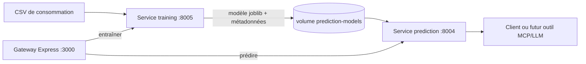

# Brief — prévision de consommation dans EnergIA

## Objectif

Faire évoluer l'exercice de régression en une capacité applicative d'EnergIA. Le jeu de données horaire ne sert pas à entraîner le LLM Gemma : il sert à entraîner un **modèle ML de régression** qui prédit `consommation_mw`.

Le LLM Ollama déjà présent garde son rôle d'assistant conversationnel. Il pourra expliquer une prédiction ou appeler ultérieurement l'API de prédiction via MCP, mais il ne doit pas être affiné à partir de ce CSV de 1 500 lignes.

## Architecture retenue



Les responsabilités sont séparées :

- `training` entraîne, évalue et publie une nouvelle version du modèle ;
- `prediction` ne réentraîne jamais. Il charge uniquement le dernier artefact publié et répond aux requêtes rapides ;
- la gateway est le seul point d'entrée pour le client ;
- le volume Docker partagé transporte l'artefact entre les deux services et le conserve entre les redémarrages.

## Données et features

Le fichier source est `data/tp1-pedagogique-conso.csv`. Il contient 1 500 observations horaires, du 1er janvier au 4 mars 2025. La cible est `consommation_mw`.

Features retenues :

- `temperature` (fournie à la requête ; une API météo sera la source de production) ;
- `jour_semaine`, `heure`, `est_weekend`, calculées depuis `timestamp` ;
- saison encodée en quatre variables binaires.

La séparation apprentissage/test respecte l'ordre du temps : 80 % des premières observations pour l'entraînement, 20 % des dernières pour le test. Il ne faut pas activer le mélange aléatoire, car il introduirait une fuite temporelle.

## Service d'entraînement — `training:8005`

L'endpoint `POST /train` est protégé par l'en-tête `x-api-key`. Il :

1. valide et prépare le CSV ;
2. entraîne un `RandomForestRegressor` ;
3. calcule MAE et MAPE sur le jeu de test ;
4. écrit le modèle `consumption_model.joblib` et ses métadonnées JSON dans `/models` ;
5. attribue une version horodatée au modèle.

`GET /health` indique si les données d'entraînement sont disponibles. L'entraînement est déclenché explicitement : il ne doit pas s'exécuter au démarrage ou à chaque prédiction.

## Service de prédiction — `prediction:8004`

`POST /predictions`, protégé par `x-api-key`, reçoit :

```json
{
  "timestamp": "2025-03-05T18:00:00+01:00",
  "temperature": 7.5
}
```

et retourne notamment :

```json
{
  "prediction_mw": 43821.52,
  "timestamp": "2025-03-05T17:00:00+00:00",
  "temperature": 7.5,
  "model_version": "rf-20260910T120000Z"
}
```

Si aucun modèle n'a été publié, le service retourne `503`, plutôt que d'inventer une prévision. `GET /health` expose cet état et `GET /model` retourne les métriques et la version publiées.

## Intégration à la gateway

- `POST /prediction/train` déclenche l'entraînement ;
- `POST /prediction` transmet une requête de prévision ;
- `GET /health-prediction` vérifie que le service de prédiction est disponible.

Les variables `TRAINING_SERVICE_URL`, `PREDICTION_SERVICE_URL`, `TRAINING_PORT` et `PREDICTION_PORT` sont ajoutées à `.env`. Les services sont déclarés dans le compose principal ; `docker-compose.override.yml` les construit depuis le dépôt local.

## Critères de validation

1. Lancer la stack, puis appeler `POST /prediction/train` via la gateway avec la clé déjà gérée par la gateway.
2. Vérifier que la réponse contient une version, MAE et MAPE.
3. Appeler `POST /prediction` avec un timestamp et une température.
4. Vérifier que `model_version` est identique à celle retournée par l'entraînement.
5. Redémarrer les conteneurs : le modèle doit rester utilisable grâce au volume nommé.

## Évolutions attendues

- comparer la forêt aléatoire à la régression linéaire et à la baseline J-1 avant de promouvoir un modèle ;
- enregistrer les requêtes et les valeurs réelles afin de surveiller la dérive ;
- remplacer la température fournie par le client par une source météo avec stratégie de repli ;
- exposer la prévision au LLM via un outil MCP, sans confondre ce dernier avec le modèle de prévision.
