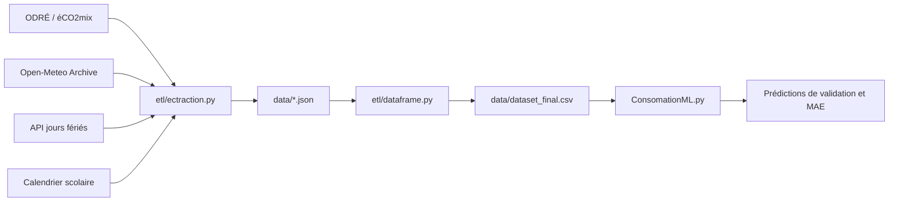

# EnergIA — Prévision de la consommation électrique régionale

EnergIA collecte des données publiques d’électricité, de météo et de calendrier, construit un dataset régional et entraîne un modèle de régression pour estimer la consommation électrique à un pas de 30 minutes.

La version actuelle est un premier modèle de référence utilisant la région et le calendrier. Son évaluation porte sur une période historique distincte de l’entraînement.

| Élément | État actuel |
|---|---|
| Données | Année 2025, 210 240 observations |
| Périmètre | 12 régions métropolitaines, hors Corse |
| Granularité | Une région par créneau de 30 minutes |
| Modèle | Régression linéaire dans une Pipeline scikit-learn |
| Entraînement | Janvier à août 2025 |
| Validation | Septembre et octobre 2025 |
| MAE de validation rapportée | **1 175,24**, dans l’unité de la cible |
| Test final | Novembre et décembre 2025, non évalué |

## Sommaire

- [Architecture](#architecture)
- [Sources de données et API](#sources-de-données-et-api)
- [Construction du dataset](#construction-du-dataset)
- [Modélisation et évaluation](#modélisation-et-évaluation)
- [Installation et exécution](#installation-et-exécution)
- [Configuration et reproductibilité](#configuration-et-reproductibilité)
- [Limites et feuille de route](#limites-et-feuille-de-route)

## Architecture

Le traitement comprend trois phases : extraction des sources JSON, fusion dans un CSV, puis apprentissage et validation.



```text
EnergIA_final/
├── ConsomationML.py                 # Prétraitement, modèle et validation
├── index.py                        # Point d’entrée non implémenté
├── etl/
│   ├── ectraction.py                # Collecte des quatre sources
│   └── dataframe.py                 # Normalisation, jointures et export CSV
├── data/                           # Données locales, ignorées par Git
│   ├── eco2mix-regional.json
│   ├── meteo-regions.json
│   ├── calendrier-2025.json
│   ├── vacances-scolaires-regions.json
│   └── dataset_final.csv
├── Data Consumption Prediction.png
└── README.md
```

Les noms `ectraction.py` et `ConsomationML.py` correspondent aux fichiers existants. Le projet consomme des API externes ; il n’expose pas encore d’API de prédiction.

## Sources de données et API

Les appels sont effectués en HTTP GET avec `requests`. Aucune clé ni aucun en-tête d’authentification n’est configuré dans le code. Les conditions d’accès et de réutilisation sont celles des fournisseurs. Les réponses sont conservées localement en JSON UTF-8 avant transformation.

### Électricité — ODRÉ / éCO2mix

**Objectif :** obtenir la consommation observée, cible du modèle, ainsi que les identifiants régionaux et les horodatages.

[Fiche officielle du dataset éCO2mix régional](https://odre.opendatasoft.com/explore/dataset/eco2mix-regional-cons-def/).

```text
GET https://odre.opendatasoft.com/api/explore/v2.1/catalog/datasets/eco2mix-regional-cons-def/exports/json
```

La source contient les mesures régionales consolidées et définitives au pas de la demi-heure, dont la consommation, les productions par filière, le pompage et les échanges. Le script réalise un export par mois pour `ANNEE = 2025`.

| Paramètre | Valeur envoyée | Utilisation |
|---|---|---|
| `where` | `startswith(date, '2025-MM')` | Filtre mensuel |
| `order_by` | `date_heure ASC, code_insee_region ASC` | Ordre des observations |
| `limit` | `-1` | Demande d’export complet |

**Champs exploités :** `code_insee_region`, `libelle_region`, `date`, `heure`, `date_heure`, `consommation`. Les autres champs électriques sont conservés dans le dataset, mais exclus du modèle actuel.

**Contrôles :** réponse JSON non vide et présence d’au moins une consommation non nulle pour chaque couple région/jour attendu. Ce contrôle ne vérifie pas chaque demi-heure ni les doublons.

**Sortie :** `data/eco2mix-regional.json`. Le script enveloppe les observations dans une structure `annee`, `source`, `nhits`, `records`, avec chaque ligne placée dans `records[].fields`.

### Météo — Open-Meteo Historical Weather API

**Objectif :** enrichir le dataset avec la température et l’humidité horaires. Ces variables ne sont pas encore intégrées dans la régression.

[Documentation de l’API historique Open-Meteo](https://open-meteo.com/en/docs/historical-weather-api).

```text
GET https://archive-api.open-meteo.com/v1/archive
```

| Paramètre | Valeur ou origine |
|---|---|
| `latitude`, `longitude` | Ville de référence de chaque région |
| `start_date`, `end_date` | Dates extrêmes des observations électriques converties en UTC |
| `hourly` | `temperature_2m,relative_humidity_2m` |
| `timezone` | `UTC` |

Le script réalise une requête par région et vérifie la présence de `hourly.time`. Les variables représentent la température et l’humidité relative à deux mètres. L’API historique s’appuie notamment sur des réanalyses ; elle ne représente pas les prévisions disponibles à l’avance.

| Code INSEE | Région | Référence météo |
|---|---|---|
| 11 | Île-de-France | Paris |
| 24 | Centre-Val de Loire | Orléans |
| 27 | Bourgogne-Franche-Comté | Dijon |
| 28 | Normandie | Rouen |
| 32 | Hauts-de-France | Lille |
| 44 | Grand Est | Strasbourg |
| 52 | Pays de la Loire | Nantes |
| 53 | Bretagne | Rennes |
| 75 | Nouvelle-Aquitaine | Bordeaux |
| 76 | Occitanie | Toulouse |
| 84 | Auvergne-Rhône-Alpes | Lyon |
| 93 | Provence-Alpes-Côte d’Azur | Marseille |

**Sortie :** `data/meteo-regions.json`, contenant une liste `regions` avec les identifiants, la ville, les coordonnées demandées et la réponse météo. La fusion contrôle que `utc_offset_seconds` vaut zéro.

### Jours fériés — API gouvernementale

**Objectif :** construire les indicateurs journaliers de jour férié et de week-end.

[Documentation de l’API des jours fériés](https://calendrier.api.gouv.fr/jours-feries/).

```text
GET https://calendrier.api.gouv.fr/jours-feries/metropole/2025.json
```

L’année est injectée dans l’URL depuis `ANNEE`. Le script attend un objet associant dates et noms de jours fériés. Il parcourt ensuite chaque jour de l’année pour produire `date`, `jour_semaine`, `weekend`, `ferie` et `nom_ferie`.

**Sortie :** `data/calendrier-2025.json`.

Le code utilise uniquement la zone `metropole`, sans calendrier complémentaire pour les particularités locales.

### Vacances scolaires — Éducation nationale

**Objectif :** déterminer l’indicateur de vacances par région et par date locale.

[Fiche officielle du calendrier scolaire](https://data.education.gouv.fr/explore/dataset/fr-en-calendrier-scolaire/).

```text
GET https://data.education.gouv.fr/api/explore/v2.1/catalog/datasets/fr-en-calendrier-scolaire/exports/json
```

L’appel ne transmet aucun filtre annuel. Après vérification d’une réponse non vide, le script associe `location` à une région grâce à `REGIONS_ACADEMIES` et ajoute `libelle_region`. Les académies sans correspondance sont signalées.

**Champs exploités :** `location`, `population`, `start_date`, `end_date`, `annee_scolaire` et la région ajoutée localement.

**Sortie :** `data/vacances-scolaires-regions.json`.

La fusion exclut les lignes sans région et celles dont `population` vaut `Enseignants`. L’indicateur régional vaut vrai si au moins une période associée contient la date. Il ne représente pas la proportion d’élèves en vacances dans les régions regroupant plusieurs académies.

### Gestion HTTP et persistance

Les collectes électriques et météorologiques utilisent `requests.Session` avec des délais de connexion et de lecture de 15 et 180 secondes. Les calendriers utilisent un délai de 60 secondes. `raise_for_status()` interrompt le traitement en cas d’erreur HTTP.

Il n’existe pas encore de reprise automatique ni de nouvelle tentative après un échec ou un quota. Les fichiers locaux permettent de relancer le modèle hors ligne ; l’extracteur les réécrit lors d’une nouvelle collecte.

## Construction du dataset

### Normalisation

`etl/dataframe.py` normalise les codes INSEE sur deux caractères, convertit `date_heure` en UTC, puis crée deux références temporelles :

- `heure_utc`, arrondie à l’heure inférieure pour joindre la météo ;
- `date_locale` et les variables calendaires, calculées en fuseau `Europe/Paris`.

Les observations électriques de 18 h et 18 h 30 UTC reçoivent ainsi la même météo horaire de 18 h UTC, sans interpolation.

### Jointures et règles métier

| Enrichissement | Clés | Jointure |
|---|---|---|
| Météo | `code_insee_region`, `heure_utc` | Gauche, `many_to_one` |
| Jours fériés | `date_locale` | Gauche, `many_to_one` |
| Vacances | `libelle_region`, `date_locale` | Gauche, `many_to_one` |

Les jointures conservent les observations électriques même si un enrichissement est absent. `many_to_one` contrôle l’unicité des clés dans les tableaux d’enrichissement.

Pour les vacances, l’intervalle est `début <= date < fin`. L’année scolaire est déterminée avec une bascule au 1er septembre. Si aucun calendrier applicable n’est identifié, l’indicateur peut rester manquant.

Le résultat est trié par `date_heure` et `code_insee_region`, puis destiné à un export CSV UTF-8 avec BOM, sans index pandas. Un défaut de l’aperçu précédant l’export est documenté dans la section d’exécution.

### Variables du modèle

`ConsomationML.py` convertit les dates, les nombres et les booléens avec `preparer_donnees()`, puis extrait les minutes du champ `heure`.

| Colonne | Rôle | Traitement |
|---|---|---|
| `libelle_region` | Entrée | Encodage one-hot |
| `mois` | Entrée, 1 à 12 | Numérique |
| `jour_semaine` | Entrée, lundi = 0 | Numérique |
| `heure_locale` | Entrée, 0 à 23 | Numérique |
| `minute` | Entrée, 0 ou 30 | Numérique |
| `ferie` | Entrée, 0 ou 1 | Numérique |
| `vacances_scolaires` | Entrée, 0 ou 1 | Numérique |
| `consommation` | Cible | Exclue des entrées |

La météo, l’année, le week-end et les saisons sont disponibles ou préparés, mais exclus de la sélection actuelle.

## Modélisation et évaluation

### Pipeline

Un modèle commun est entraîné sur les douze régions. La préparation est ajustée sur les seules données d’entraînement.

```python
preparation = ColumnTransformer(
    transformers=[
        ("region", OneHotEncoder(handle_unknown="ignore"), ["libelle_region"])
    ],
    remainder="passthrough",
)

modele = Pipeline([
    ("preparation", preparation),
    ("regression", LinearRegression()),
])
```

`OneHotEncoder` transforme la région en indicateurs et les six autres variables sont conservées numériquement. Une région inconnue ne provoque pas d’erreur d’encodage, mais sa qualité de prédiction n’est pas garantie.

### Protocole temporel

| Partition | Dates locales incluses dans le CSV 2025 | Lignes |
|---|---|---:|
| Entraînement | 1er janvier au 31 août | 139 968 |
| Validation | 1er septembre au 31 octobre | 35 136 |
| Test | 1er novembre au 31 décembre | 35 136 |

Le découpage utilise `date_locale`, sans mélange aléatoire. Toutes les régions d’une même date restent dans la même partition. Le test final est réservé jusqu’au choix du modèle.

```python
modele.fit(X_train, y_train)
predictions = modele.predict(X_validation)
mae = mean_absolute_error(y_validation, predictions)
```

`fit` ajuste la préparation et la régression. `predict` applique le modèle appris aux lignes de validation, sans recevoir leurs consommations réelles. La période prédite dépend des lignes fournies : le script ne construit pas encore un horizon futur.

### Résultats disponibles

La MAE de validation rapportée pendant le développement est **1 175,24** sur les 35 136 observations de septembre et octobre. Elle correspond à la moyenne de `abs(consommation_reelle - consommation_predite)`, dans l’unité de la cible, et non à un pourcentage.

| Région — exemples affichés | Réel | Prédit |
|---|---:|---:|
| Île-de-France | 5 462 | 5 858,5 |
| Centre-Val de Loire | 1 703 | 483,5 |
| Bretagne | 2 003 | 935,2 |
| Occitanie | 3 392 | 2 674,9 |

Aucune comparaison à une référence naïve ni analyse par région n’a encore été réalisée. Ce résultat n’est pas un score de test final et ne constitue pas une validation opérationnelle. Il provient de l’exécution de développement rapportée ; l’entraînement n’a pas été relancé pour rédiger cette documentation.

### Schéma du traitement ML


## Installation et exécution

### Dépendances

- Python et un environnement virtuel ;
- `pandas` pour les données ;
- `requests` pour les API ;
- `scikit-learn` pour le modèle et les métriques ; NumPy et SciPy sont installés comme dépendances.

`pathlib`, `json` et `datetime` appartiennent à la bibliothèque standard.

Depuis la racine du projet, exemple PowerShell pour une nouvelle installation :

```powershell
python -m venv .venv
.\.venv\Scripts\python.exe -m pip install pandas requests scikit-learn
```

Si un environnement existe déjà, utiliser son interpréteur. Aucun fichier de dépendances verrouillées n’est fourni actuellement ; ces commandes ne garantissent donc pas les versions exactes de l’expérience initiale.

### Utiliser le CSV existant

```powershell
.\.venv\Scripts\python.exe ConsomationML.py
```

`data/dataset_final.csv` doit être présent. Son chemin est résolu à partir du script. Chaque lancement réentraîne le modèle, affiche dix observations de validation et la MAE. Aucun appel réseau n’est nécessaire. La Pipeline et les prédictions ne sont pas sauvegardées.

### Reconstruire le dataset

L’ordre prévu est :

```powershell
.\.venv\Scripts\python.exe etl\ectraction.py
.\.venv\Scripts\python.exe etl\dataframe.py
.\.venv\Scripts\python.exe ConsomationML.py
```

**Défaut connu avant reconstruction :** dans `etl/dataframe.py`, la liste de colonnes utilisée pour l’aperçu contient `saison_hiver`, `saison_printemps`, `saison_ete` et `saison_automne`, absentes du DataFrame construit par ce script. Leur sélection peut provoquer un `KeyError` avant `to_csv`. Il faut les retirer de cet aperçu ou les créer dans l’ETL avant de relancer la génération complète. Ce README ne modifie pas les scripts.

L’extraction réécrit les JSON et nécessite un accès réseau. Après correction du défaut, la fusion réécrit le CSV. Le CSV existant reste utilisable indépendamment pour l’entraînement.

## Configuration et reproductibilité

| Paramètre | Emplacement |
|---|---|
| Année extraite | `ANNEE`, dans `etl/ectraction.py` |
| Régions et coordonnées météo | `REGIONS`, dans `etl/ectraction.py` |
| Correspondances académiques | `REGIONS_ACADEMIES`, dans `etl/ectraction.py` |
| Variables du modèle | Liste `colonnes`, dans `ConsomationML.py` |
| Périodes de validation et de test | Masques de dates, dans `ConsomationML.py` |
| Algorithme | Étape `regression` de la Pipeline |

Changer l’année d’extraction ne modifie pas les bornes d’apprentissage. Les masques actuels ne bornent pas le début de l’entraînement ni la fin du test ; ils doivent être revus en cas d’ajout d’autres années.

`data/` est ignoré par Git : un clonage du dépôt ne fournit pas les données. Il faut transmettre les fichiers locaux ou les reconstruire après correction de l’ETL.

La reproductibilité reste à renforcer par la conservation des versions de dépendances, de la date d’extraction, des paramètres des API, de l’empreinte du CSV et des métriques de chaque expérience. Un téléchargement ultérieur peut intégrer des révisions des données sources.

## Limites et feuille de route

### Limites connues

- **Périmètre :** Corse et outre-mer absents ; aucun total national calculé.
- **Qualité :** contrôle de couverture région/jour, mais pas de validation exhaustive des demi-heures ou des doublons. Les conversions numériques peuvent créer des valeurs manquantes ; aucune imputation n’est implémentée.
- **Météo :** une seule ville représente chaque région. L’usage en prévision devra reposer sur des variables réellement disponibles au moment de décider.
- **Calendriers :** agrégation régionale des vacances et absence de particularités locales des jours fériés.
- **Modèle :** calendrier traité linéairement, sans encodage cyclique ni interaction explicite avec la région ; prédictions non contraintes à être positives.
- **Évaluation :** une seule année et une seule fenêtre de validation ; robustesse interannuelle non établie.
- **Exploitation :** aucune sérialisation, API d’inférence, génération d’entrées futures ou journalisation des expériences. Le script ML s’exécute au chargement et n’est pas encore structuré comme module réutilisable.
- **ETL :** défaut de colonnes dans l’aperçu à corriger avant régénération du CSV.

### Prochaines étapes

1. Fiabiliser l’ETL et contrôler les doublons, les valeurs manquantes et la couverture temporelle.
2. Établir une référence naïve et mesurer les erreurs par région et par créneau.
3. Comparer la régression linéaire et Random Forest sur des fenêtres chronologiques cohérentes.
4. Tester le calendrier cyclique, la météo et des consommations retardées disponibles au moment de prévoir.
5. Évaluer le modèle retenu sur le test final réservé.
6. Versionner et sauvegarder la Pipeline, construire les entrées futures et exporter les résultats.

---

Documentation établie à partir des scripts et du dataset examinés, jusqu’à la première évaluation du modèle linéaire. Les références officielles des quatre sources sont indiquées dans les sections API.
