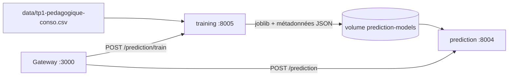

# EnergIA — microservices de prévision

Ce dossier transforme l'exercice de régression de consommation électrique en deux microservices complémentaires : un service qui entraîne et publie le modèle, puis un service qui l'utilise pour produire des prévisions.

> Le modèle entraîné est un modèle de machine learning de régression, pas le LLM Ollama/Gemma du projet. Le LLM peut ultérieurement interroger ce service via MCP afin d'expliquer une prévision.

## Architecture



| Composant | Responsabilité |
| --- | --- |
| `training_main.py` | Entraîne, évalue et publie une nouvelle version du modèle. |
| `main.py` | Charge le modèle publié et sert les prévisions. Il ne réentraîne jamais. |
| `core.py` | Préparation des features, entraînement, stockage et chargement du modèle. |
| `data/tp1-pedagogique-conso.csv` | Jeu de données pédagogique, utilisé uniquement à l'entraînement. |
| `models/` | Emplacement local des artefacts ; en Docker, il est remplacé par le volume partagé `/models`. |

## Données et modèle

La cible est `consommation_mw`. Les variables explicatives sont :

- la température fournie lors de la requête ;
- l'heure, le jour de semaine et le week-end, dérivés du timestamp ;
- la saison, encodée sur quatre variables binaires.

Le modèle est un `RandomForestRegressor` avec 200 arbres et une profondeur maximale de 10. Le split conserve la chronologie : les 80 % premières observations servent à l'entraînement et les 20 % dernières à l'évaluation. Ce choix évite la fuite d'information temporelle.

À la publication, le service écrit :

- `consumption_model.joblib` ;
- `consumption_model.metadata.json`, avec la version, la date d'entraînement, les métriques et les features.

## Prérequis

- Docker et Docker Compose ;
- le fichier `.env` de la racine, avec `SECURITY_TOKEN` et les variables :

```dotenv
PREDICTION_PORT=8004
TRAINING_PORT=8005
PREDICTION_SERVICE_URL=http://prediction:8004
TRAINING_SERVICE_URL=http://training:8005
```

Les dépendances Python sont définies dans `requirements.txt` : FastAPI, Uvicorn, pandas, scikit-learn et joblib.

## Démarrer les services

Depuis la racine du projet :

```powershell
docker compose up --build training prediction
```

La configuration dédiée peut aussi être utilisée :

```powershell
docker compose -f docker-compose.yml -f docker-compose.prediction.yml up --build training prediction
```

Les documentations OpenAPI sont disponibles sur :

- <http://localhost:8005/docs> — entraînement ;
- <http://localhost:8004/docs> — prédiction.

## Entraîner un modèle

L'entraînement est volontairement déclenché à la demande. À travers la gateway, qui transmet la clé d'API :

```powershell
Invoke-RestMethod -Method Post http://localhost:3000/prediction/train
```

La réponse contient l'état de publication, une version horodatée, le nombre de lignes et les métriques de test :

```json
{
  "success": true,
  "response": {
    "status": "published",
    "model_version": "rf-20260910T120000Z",
    "metrics": {
      "mae_mw": 1087.641,
      "mape_percent": 2.694
    }
  }
}
```

L'API interne propose aussi `POST /train` sur le port 8005. Elle exige l'en-tête `x-api-key`; cet endpoint est prévu pour les appels de confiance entre services, pas pour être exposé directement au navigateur.

## Demander une prévision

Via la gateway :

```powershell
$body = @{ timestamp = "2025-03-05T18:00:00+01:00"; temperature = 7.5 } | ConvertTo-Json
Invoke-RestMethod -Method Post -Uri http://localhost:3000/prediction -ContentType "application/json" -Body $body
```

Exemple de réponse :

```json
{
  "success": true,
  "response": {
    "prediction_mw": 40985.05,
    "timestamp": "2025-03-05T17:00:00+00:00",
    "temperature": 7.5,
    "model_version": "rf-20260910T120000Z"
  }
}
```

`GET /health-prediction` via la gateway indique si un modèle est disponible. Tant qu'aucun entraînement n'a publié d'artefact, `POST /predictions` renvoie `503 Service Unavailable` plutôt qu'une valeur fictive.

## Persistance et sécurité

Le volume Docker nommé `prediction-models` est monté en écriture dans `training` et en lecture seule dans `prediction`. Ainsi, un redémarrage ne supprime pas le modèle et le service de prédiction ne peut pas l'écraser.

Les routes sensibles utilisent `SECURITY_TOKEN`, transmis sous l'en-tête `x-api-key`. Ne placez jamais cette clé dans le code, dans le README ou dans une requête frontend.

## Contrôles réalisés

Le flux local a été vérifié avec le CSV fourni : entraînement, écriture de l'artefact, rechargement du modèle et prédiction. La métrique obtenue sur le jeu de test était :

- MAE : 1 087,641 MW ;
- MAPE : 2,694 %.

Ces valeurs sont pédagogiques : le jeu de données est court et ne couvre que l'hiver et le début du printemps 2025.

## Pistes d'évolution

- comparer systématiquement la forêt aléatoire à une régression linéaire et à une baseline J-1 ;
- remplacer la température saisie par une API météo, avec une valeur de repli ;
- historiser les prédictions et les valeurs réelles pour surveiller la dérive ;
- ajouter un outil MCP afin que le LLM explique une prévision à partir de la réponse structurée du service.
